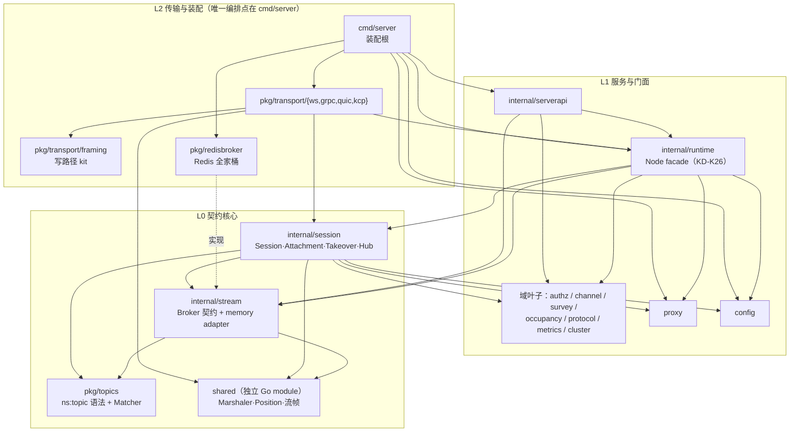

# CONTEXT — messageloop 架构语境（从核心向外）

| 字段 | 值 |
| --- | --- |
| 基准 | commit `2ab08d9`（架构深化批 1-5 落地后），2026-10-04 走查 |
| 方法 | 三个并行探查代理按层走查（L0/L1/L2），`/codebase-design` 词汇（module / interface / depth / seam / adapter / leverage / locality），关键疑点人工复核 |
| 阅读顺序 | [GLOSSARY.md](GLOSSARY.md)（域词）→ 本文（分层与 seam 目录）→ [docs/adr/](docs/adr/README.md)（已裁决不重开）→ [架构评审与深化裁决](docs/design/2026-10-04-architecture-review-decisions.md)（D1-D21 全文） |
| 上位裁决 | [docs/v2/kernel-architecture.md](docs/v2/kernel-architecture.md)（KD-\* 宪法）优先于本文 |

本文是「地图」，不是「法律」：裁法看 ADR 与 KD-\*，命名看 GLOSSARY，本文回答「东西在哪、缝在哪、深度如何、还欠什么」。

---

## 一、分层总览

依赖方向总体 **L2 → L1 → L0**（箭头 = import，指向被依赖方）。全仓无依赖环（走查确认）。

两条**有意的例外边**（记录在案，不算违规，但动它们前先想清楚）：

- `pkg/transport/*` 与 `pkg/redisbroker` 上行 import `internal/*`：transport adapter 需要 `runtime.NewClient` 装配入口，redisbroker 实现 `internal/stream.Broker`。同模块合法；代价是这些 pkg 不能当纯公共库外发。
- `config → proxy`（`ToProxyConfig`，config.go:341）：唯一「底层依赖偏上层」的边，不构成环；是 authz↔config capability 双表（见 §五.2）无法单源化的根因。

---

## 二、L0 契约核心（改动最贵，接口最少）

被全仓依赖、自身几乎不依赖人。这一层的接口就是全仓的测试面。

### shared（独立 Go module）

`github.com/messageloopio/messageloop/shared`（go 1.25.5，仅依赖 grpc/protobuf），根模块 `require v0.2.0 + replace ./shared`。独立的意义：`sdks/go` 复用 wire 契约而不拖入服务端实现。生产 285 行。

- **`Marshaler`**（marshaler.go:12）：5 方法（Marshal / MarshalAppend / Unmarshal / Name / **IsJSONWire**）。3 个生产 adapter 同文件（JSON / Protobuf / protoJSON 单例），全仓 35 文件 import。`IsJSONWire` 是 D12 落地：禁止用 `Name()` 字符串分支嗅探线格式（唯一消费者 hub 的 jsonRaw splice，hub.go:462）。
- **`PositionFrom`**（position.go:16，仅 23 行但语义 load-bearing，KD-K22）：Position 的唯一构造点，5 个生产调用全经它。
- `streamframe.go`：QUIC/KCP 的长度前缀帧 + ALPN 常量。
- 已知债务：`Marshal(msg any)` 弱类型（运行时才暴露 MarshalTypeError）；`Marshalers` 全局可变切片。历史形状，未裁决动它。

### pkg/topics（真叶子，零本项目依赖）

- **`Matcher`**（matcher.go:82）：3 方法（Subscribe / Unsubscribe / Lookup），**1 个生产 adapter**（csTrieMatcher，554 行 lock-free，CAS 协议 + `maxCASRetries=1000` yield 预算）。四族比较实现已按 D20 退役，基准快照留在裁决文档附二。
- `ns:topic` 多租户语法（`SplitSegments`，"."/":" 双分隔符）；`Subscriber` 为空接口 marker。

### internal/stream（pub/sub 契约 + memory adapter）

- **`Broker`**（broker.go:195）：**10 方法，含 `Epoch() string` 一等能力**（D5：接口注释明文「不许 type assertion」，broker 缺 epoch 时失配门静默放行是已消灭的 bug 类）。2 个生产 adapter：本包 `memoryBroker`（483 行）与 `pkg/redisbroker.redisBroker`（接口断言 redis.go:549）。
- memory 实现的顺序契约：64 dispatch shard × 256 深度，同 channel 同 shard 保序（broker_memory.go:25-28）。
- memory ≡ Redis 等价性是 KD-K14 硬规则；memory 侧已知的语义弱化（SetGapHandler no-op、HistoryTTL warn-once、HistorySize 0 = 默认 256）藏在实现里，改前先读注释。

### internal/session（内核之核）

生产 3,687 行 / 测试 2,856 行。Session 状态机、Attachment 换绑、Takeover 仲裁、Hub 分片注册表（64 conn shard + 16,384 sub shard）、双 lane sendQueue（Control 32 / Data 256）。

- **`session.Transport` seam**（transport.go:7）：4 方法（Write / WriteMany / Close / RemoteAddr）。**4 个生产 adapter**（ws / grpc / quic / kcp，各带 `var _ session.Transport` 断言），约 10 个测试替身。`ErrPeerGone` sentinel 也住这（D11：对端关闭的错误分类归 adapter，session 不再反向 import gorilla/websocket 与 grpc status）。
- **`session.Runtime` seam**（runtime.go:95）：**38 方法**，生产 adapter 唯一（internal/runtime 的 `nodeRuntime`），测试替身唯一（`fakeRuntime`）。这是全仓最宽的 interface——宽是已知现状（D16 明确不趁机重构），不是待办默认项。
- **Takeover 模块**（takeover.go，158 行）：三重身份比较器——① `canonical()` delegate 路由；② attachment 指针身份（`closeFromAttachment` / `closeFromLoop`）；③ transport 身份（`closeIfServingHandoff`）。single-activation 硬不变量在此归属；交接执行入口 `takeoverBy`（Detach → handoff Attach → 壳降级全序列，由 handleConnect 调用）。
- **`HeartbeatConfig.ReadDeadline(configured)`**（heartbeat.go:28）：读时限公式单点（D10），ws/quic/kcp read loop 共用；grpc 的 `Recv()` 无 deadline，靠 session 层心跳兜底。
- runtime.go 生产文件携带测试专用面（6 个 `*ForTest` + 8 个导出包装，:269-336）——leave-root tests 的迁移妥协，D19 裁定机会主义处理。

---

## 三、L1 服务与门面

### internal/runtime — Node facade 之家（KD-K26 / D18）

生产 4,892 行 / 测试 14,913 行（3:1）。session 面、Server API 面、集群状态/命令/resume、recover 重放、survey、presence 全挂 `*Node`。

- **`ServerAPIRuntime`**（serverapi_runtime.go:17）：**18 方法**——serverapi handler 的真实调用切片（授权三元组、user fan-out、session 命令四件、survey/presence/channels、Broker + StreamEpoch、PublishForAPI）。`*Node` 唯一生产 adapter + 编译期断言（:50）；**无测试替身**（serverapi 测试全用真 Node）。
- recover 模块（recover.go）：`SnapshotRecoverySubs`（快照独有频道合成 Recover:true）、`recoveryCursor`（fresh / epoch 失配 / 缺 offset / deliveredOffset 兜底的五返回值裁决）、`recoverySkip`（五道 pre-History gate）。TS SDK "fresh implies recover" 事故（7ce8784）的 bug 类单一归属地（D7）。
- `aliases_local.go`：169 条转发别名（cluster 43 / session 30 / authz 26 / …）——外部测试包 leave-root 后的兼容面，编译器兜底但阅读面翻倍。
- `cluster_sim.go`：3 个 `Sim*` 导出专为 sim 测试 reach 未导出入口，生产不得调用（批 4 偏差记录已澄清其保留理由）。

### internal/serverapi

生产 1,686 行 / 测试 3,379 行。Server API gRPC handler（8 个 RPC）+ api_auth interceptor + scope 层。消费 `runtime.ServerAPIRuntime`；`PrepareServer` 是唯一生产入口（被 cmd/server 调用）。scope 三重 census 钉住 proto 字段 ↔ 注册表 ↔ 能力位（见 §六）。

### 域叶子（供内核与门面共用）

- **internal/authz**：`Authorizer` 具体类型（非 interface）——Action/Principal/Capability/Decision 唯一求值器（KD-K10）。capability 名字双表 + census（§五.2）。
- **internal/channel**：ChannelPolicy 值类型（13 字段）+ Overlay + `ErrAddHistoryDenied`（与 `Node.PublishForAPI` 成对：addHistory 且 policy 禁 history → 零发布 + sentinel，serverapi `errors.Is` 消费）。
- **internal/survey**：零依赖叶子。`ClampTimeout`（defaults.go:32）是 client 面与 Server API 面共用的超时钳制单点（D8/批 2 落地在叶子包而非 Node 方法，纯函数免扩 38 方法缝）。
- internal/{occupancy,protocol,metrics,cluster}：各自单一职责的支撑叶子。

### proxy — 后端代理抽象

- **`Proxy`** interface：11 方法，2 个生产 adapter（HTTPProxy / GRPCProxy）+ 2 测试替身。
- `Router.ByName(name)`（router.go:93）：显式指派按名直达，无 glob 遮蔽（D1 落地，两条隐患测试钉住）。api_auth 解析链：`cmd/server/runtime.go:93` `apiAuthFindProxy` → `node.FindProxyByName` → `proxy.ByName`。
- `UserInfo` 镜像由 census 钉住（proxy ↔ proxypb ↔ sdks/go 三方，D3）。

### config

单文件 780 行 / 28 类型；顶层 5 字段（Server / Transport / Broker / Cluster / Proxy），嵌套深度 4。`Validate` 约 250 行是配置契约的落点（死字段显式拒绝，KD-K31）。

---

## 四、L2 传输与装配

### pkg/transport/framing — 写路径 kit（D9）

`Writer`（互斥 + 每写时限 + closed 旗标 + `MarkClosed`）与 `DisconnectMessage`（DISCONNECT_ERROR 信封唯一形状）。149 行，被 quic/kcp（收编 ~148 行克隆）与 grpc（只用 DisconnectMessage）使用；**ws 不用**（gorilla 自带帧协议 + WriteControl 原生 close 帧）。grpc 的 channel/worker 发送模型与 Writer 不兼容——这是有意差异，见 ADR-0009。2026-10-05 补齐 8 个单测：sentinel 与 MarkClosed 幂等、每帧 deadline 布防/批末清除、DisconnectFrameTimeout 预算、MarkClosed 后断连帧仍可写的顺序契约、marshal 错误零出线、信封形状、并发帧完整性。

### 四个 transport adapter（都满足 session.Transport seam）

| | transport.go 行数 | framing.Writer | ErrPeerGone 包装 | ReadDeadline |
| --- | --- | --- | --- | --- |
| ws | 104（自有 mutex 写 + WriteControl） | 不用 | ✅ close 1000/1001（transport.go:96） | ✅ |
| grpc | 230（channel/worker 模型，最大） | 只用 DisconnectMessage | ✅ Canceled/Unavailable（transport.go:222） | 无（Recv 无 deadline） |
| quic | 93（近纯委托 Writer + wrapPeerGone） | ✅ | ✅ 对端 CONNECTION_CLOSE（`ApplicationError` 且 `Remote=true`） | ✅ |
| kcp | 72（近纯委托 Writer） | ✅ | ❌ 无对端关闭形状（死端归读超时，ADR-0001） | ✅（另有显式超时分支：KCP 无 keepalive，靠此踢静默对端） |

装配入口统一：`runtime.NewClient(ctx, node, transport, marshaler, session.WithProtocol(...))` + `node.MaxMessageSize()` + `node.GetHeartbeatConfig()`——D17 裁定不再为这 3 项命名小 interface，构造函数即是那个 seam。

ErrPeerGone 的对称性于 2026-10-05 裁决补齐：quic 包装对端 CONNECTION_CLOSE（`*quic.ApplicationError` 且 `Remote=true`，落 `WriteMany`）；kcp 按设计不包装——写路径不存在对端关闭形状（UDP 往消失对端写不会失败），死端检测归读超时（心跳域）。排除项与理由见 ADR-0001；ws / grpc / quic 三份 `wrapPeerGone` 的分类纪律由各自 transport_test 的形状表钉住。

### pkg/redisbroker — Redis 全家桶

生产 3,898 行。一个包承载 5 个正交角色：stream.Broker（含 Epoch，redis.go:554，`SET NX` 持久化）、presence store、cluster session directory、command bus、query store。生产只被 cmd/server import。五合一包是已知最大「浅模块包、深内容」候选（未裁决动它）。

### cmd/server — 装配根（唯一编排点）

664 行。顺序：config Validate → `NewNode` → metrics → `setupCluster`（**node_epoch INCR 是 IncarnationID 唯一来源**，失败拒启）→ `newBroker`（redis | memory）→ proxy → gRPC 双面 → ws → admin → quic? → kcp?。preflight = 监听器预绑定（gRPC/QUIC/KCP 在 accept 循环前即失败）。QUIC 心跳联动：`MaxIdleTimeout = max(2×idle, 5min)` 保证应用层 3511 先于传输层 idle（main.go:342）。

### internal/redistest — Redis 缺席策略单点

29 行。本地 skip + `MESSAGELOOP_TEST_REDIS_REQUIRED=1` 硬失败（CI 防假绿）。注意只覆盖 2 个测试文件，redisbroker 其余 ~3,700 行测试未走它（§五.3）。

---

## 五、开放摩擦（本次走查留档，按危害排序）

以下均为**未裁决**事项——动它们之前先过 grilling，别当默认待办。（「Takeover 抽而未接」2026-10-05 接线闭合删除；「ErrPeerGone 不对称」2026-10-05 裁决后移入 ADR-0001 删除；「模板小函数拷贝」「framing 0 单测」2026-10-05 清障批收敛/补齐删除。）

1. **session.Runtime 38 方法宽缝**。1+1 adapter；fakeRuntime 201 行大半 no-op 样板。D16 明确保持现状——列入此处是提醒：任何往 Runtime 加方法的 PR 都在加宽它，先问能不能走 ServerAPIRuntime 式的调用方切片或叶子函数（批 2 的 ClampTimeout 就是范例）。
2. **authz↔config capability 双表**是结构性妥协（config→proxy 已占住方向，反向并入即成环），census 是补偿不是消除；结构性根治（AuthorizerConfig 移入 authz 反转环）已记为 C4 批随行候选，未裁决。
3. **测试覆盖不均**：quic/kcp 的 handler_test.go 是空壳（读循环错误分类无直接单测）；redistest 只覆盖 2 个测试文件；survey.go 的 Wait/去重/Close 逻辑无直接单测。
4. **grpc Options 双用途**：7 个 `API*` 字段只服务 Server API 面，client server 用不到——Options 成了两个使用方的联合形状。
5. **测试 reach-in**：直接摸 `node.hub` / `node.authorizer`、改写 `surveySendTimeout` 包级变量等 40+ 触点（D19 裁定机会主义，仅在阻塞实施时顺手收）。

> 2026-10-05 清障批落地记录：`isWildcard` 五份收敛为 `topics.IsWildcard` 单点（authz/helpers.go 整文件删除，redisbroker 改名版一并收编）；`MarshalJSONStruct` 收敛至 internal/stream 单份（session 份与 runtime 别名删除——后者本就无人使用）；hub 的 exact+wildcard 合并去重收敛为 `mergeMatchingSubscribers`（BroadcastPublication 与 GetMatchingSubscribers 共用，PresenceRecipients 因 ephemeral 耦合保留独立实现并注释理由）；framing 补 8 个单测。

---

## 六、测试纪律（既定，不是建议）

- **全绿门槛**：`go build ./... && go test ./...`；Redis 在场则集成项必跑（`MESSAGELOOP_TEST_REDIS_REQUIRED=1` 严格模式，`docker run --rm -p 6379:6379 redis:7-alpine`）。
- **census 清单**（手工同步表必须 census 钉住，ADR-0008）：capability 双表（authz）、UserInfo 三方镜像（proxy/sdks）、rpcScope 注册表（serverapi，8 RPC × proto 字段 × 能力位三重交叉）。
- **matrix 集成**从 Server API 真实面进入（api_key_scope_test，1,280 行）。
- **close 路径护航**：client_fix_test 44 例从 Session 公开面驱动——动 Takeover 地盘前必跑。
- 本地无 Redis 的全绿**不含** redisbroker/runtime 集群集成/sdks e2e 项，不假绿。

---

## 七、维护本文

- 分层/seam 目录随结构性改动更新（新 seam、adapter 数变化、层间边变化）。
- §五开放摩擦按「已裁决 → 移入 ADR」「已消 → 删除」滚动。
- 与 GLOSSARY.md 的分工：GLOSSARY 管「词」，本文管「图」；新模块命名先查 GLOSSARY，落位先查本文 §一。
