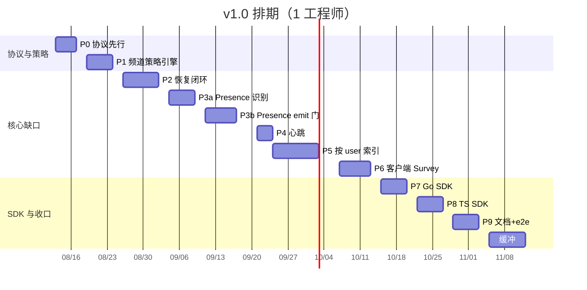
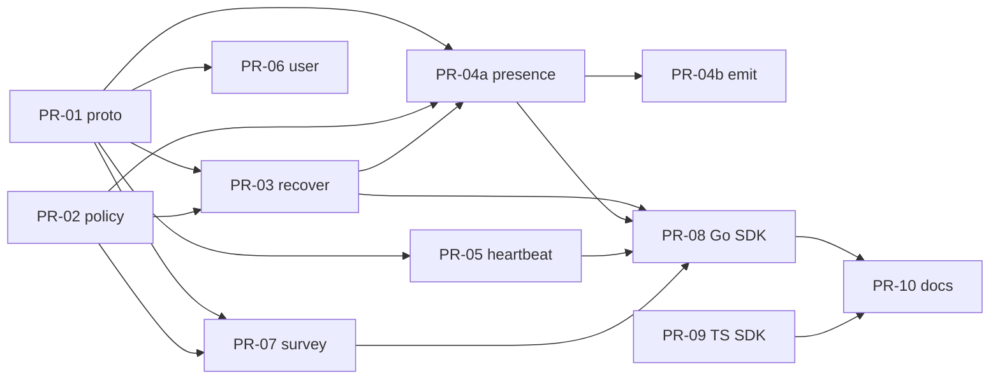

# MessageLoop ROADMAP

MessageLoop 是双向实时 Messaging Platform，主场景是 **IM、Chat Room、Gaming、IoT**。Centrifugo 只作参考，不要求协议、Admin HTTP 或 namespace 语法一致。

客户端直发、通配订阅、Survey、客户端双向 gRPC、session 级集群 takeover 是差异化能力，v1.0 保留并做完整。

| 里程碑 | 状态 | 目标 |
| --- | --- | --- |
| **v0.2 preview** | 当前主干 | 内核可用：双传输、通配、Connect 恢复、session takeover、Admin Survey |
| **v1.0** | 设计已批准，待实现 | 四场景产品闭环（见下表七缺口） |
| **v1.x** | 预留 | PresenceStats、last will、发布幂等键、更多 SDK、JWT、Admin UI |

细化设计（协议字段、时序、备选、验收、安全）：[docs/design/v1.0-platform-gaps.md](docs/design/v1.0-platform-gaps.md)。

---

## 定位与非目标

**做**

- 一条双向连接上完成 pub/sub、RPC、Survey。
- 频道是会话 / 房间 / 对局 / 设备主题（点分层 + `*` / 末尾 `**`）。
- 可靠消息（进历史）与瞬时消息（`transient`）并存。
- 寻址：channel + session + **user**（Admin 扇出到该用户全部端）。

**v1.0 明确不做**

- 抄 `ns:` / `#uid` / `$`。
- HTTP `/api` 与多语言 HTTP 客户端库。
- 内置 JWT/JWKS（继续 proxy token）。
- SSE / 单向传输。
- Fossil delta、map subscriptions、PG broker。
- Admin UI / Helm。
- 一次铺齐 Dart / Swift / Java SDK。

---

## 能力地图

```mermaid
flowchart LR
  subgraph v02 ["v0.2 preview"]
    A1[WS + 客户端 gRPC]
    A2[通配 * / **]
    A3[Connect 恢复]
    A4[PresenceStore]
    A5[Admin Survey]
    A6[Session takeover]
  end
  subgraph v10 ["v1.0"]
    B1[Subscribe 恢复 + recovered]
    B2[一等 Presence]
    B3[按 user 投递/断开/订阅]
    B4[服务端 ping + 可配 idle]
    B5[客户端 Survey]
    B6[通配 presence 语义]
    B7[频道前缀策略]
  end
  subgraph v1x ["v1.x"]
    C1[PresenceStats]
    C2[Last will]
    C3[幂等键]
    C4[更多 SDK]
  end
  v02 --> v10 --> v1x
```

---

## v1.0 功能缺口

七项全部是发版门禁。细节与 Given/When/Then 见设计文档对应章节。

| # | 缺口 | 谁需要 | 拍板方案 |
| --- | --- | --- | --- |
| 1 | Subscribe 不恢复；Connect 失败/截断静默 | IM、聊天室、IoT | Connect/Subscribe 共用 helper；`recovered` / `truncated` / `RECOVER_FAILED` 可见；resume 缺 offset **不**从头倒；`history=false` → Skipped |
| 2 | 在场无默认消费者 | 聊天室、IM | 一等 `presence_event`；精确频道投递；快照带 cap；**两阶段**：先学会 drop/rewrite，再开 `cluster_emit` |
| 3 | Admin 只认 session | IM 多端、房管踢人 | 扩展现有 Admin 消息加 `users` / `user_id`；Redis user→sessions；展开校验 `lease.UserID` |
| 4 | 默认 idle 300s，服务端不 ping | 游戏、IoT | 默认仍 300s；可选 `ping_interval`；未应答在 `ping_timeout` 断开；Pong 续 lease/presence |
| 5 | 客户端 Survey 是 echo | 游戏 ready-check、IoT 查询 | 真调 `Node.Survey`；**异步 worker**（不堵读循环）；默认拒绝 + 全集群人数预检 |
| 6 | `a.**` 的 `__presence` 被 ValidateTopic 拒绝 | 通配房间/设备群 | **不**放宽 `ValidateTopic`；通配者不写伴生频道；收精确频道上的一等事件 |
| 7 | 历史/presence 全局一套容量 | 四场景共用集群 | 前缀 glob 策略（first-match）：如 `im.**` 开历史+presence，`game.tick.**` 强制 transient |

---

## 排期（1 名熟手）

基准日 **2026-08-13**。人周是投入，日历是 W1–W14。目标 **v1.0 = 2026-11-14**。

守 2026-10-31 只能砍：TS SDK 延后、PresenceQuery 延后、或第二人并行 SDK。不建议把「砍 Survey / 服务端 ping」当作正式 v1.0。

| 阶段 | 日历 | 人周 | 交付 | 里程碑 |
| --- | --- | --- | --- | --- |
| P0 协议先行 | W1 | 0.8 | proto 字段号冻结 + 生成代码 | **M0 号冻结** |
| P1 频道策略 | W2 | 1.0 | `ChannelPolicyEngine` | M1 |
| P2 恢复 | W3–W4 | 1.4 | Subscribe/Connect 共用恢复，结果可见 | M2 |
| P3a Presence 识别 | W4–W5 | 1.0 | drop/rewrite `ml.type=presence`，不跨节点 emit | 混部安全 |
| P3b Presence 门闩 | W5–W6 | 1.2 | 快照/Query；`cluster_emit` 默认关 | **M3 单节点聊天室** |
| P4 心跳 | W6 | 0.6 | 服务端 ping，lease 可短于 600s | M4 |
| P5 按 user | W7–W8 | 2.0 | Admin by user + 索引校验 | M5 |
| P6 客户端 Survey | W8–W9 | 1.3 | 异步 Survey，默认 deny | M6 |
| P7 Go SDK | W9–W10 | 1.0 | recover / presence / Survey / Pong | **M7 Go preview** |
| P8 TS SDK | W10–W11 | 1.0 | 与 Go 对齐（可滑入缓冲） | M7b |
| P9 文档+e2e | W11–W12 | 1.2 | 文档与集群验收 | **M8 RC ~2026-11-05** |
| 缓冲 | W13–W14 | 1.5 | 混部、索引、热路径、flake | **v1.0 2026-11-14** |

**合计约 14 人周。** `client.go` 上 PR-03 → 04a → 05 → 07 **必须串行**。

---

## 实现顺序（PR Plan）

每个 PR 可独立合并、独立回滚。完整说明见[设计文档 PR Plan](docs/design/v1.0-platform-gaps.md#pr-plan)。

| PR | 标题 | 依赖 | 规格 |
| --- | --- | --- | --- |
| 01 | proto：恢复 / Presence / Survey / 心跳 / user 字段（只加字段） | — | [规格](docs/design/tasks/pr-01-protocol.md) · [prompt](docs/design/tasks/pr-01-prompt.md) |
| 02 | 频道前缀策略引擎 | 可与 01 并行 | [规格](docs/design/tasks/pr-02-channel-policy.md) · [prompt](docs/design/tasks/pr-02-prompt.md) |
| 03 | Subscribe/Connect 共用恢复 + 可见结果 | 01, 02 | |
| 04a | Presence 识别与本节点投递（不 emit） | 01, 02, 建议 03 | |
| 04b | 打开 `cluster_emit`（舰队齐后） | 04a 全节点 | |
| 05 | 服务端 ping + 可配秒级 idle | 01 | |
| 06 | Admin 按 user 投递/断开/订阅 | 01 | |
| 07 | 客户端 Survey 真实现 | 01, 02 | |
| 08 | Go SDK v1.0 API | 03–07 | |
| 09 | TypeScript SDK v1.0 API | 同 08，可并行 | |
| 10 | 文档与集群 e2e | 08（09 可后到） | |

---

## 发版门禁（v1.0）

- `go test ./...` 与相关包 `go test -race` 通过。
- 通配 presence 不再写非法伴生频道；`ml.type=presence` 不得当普通 publication。
- 恢复失败 / resume 缺 offset 不倒流；`history=false` → Skipped。
- 按 user 展开校验 `lease.UserID`。
- 客户端 Survey 异步 + 放大拒绝（默认关）。
- `docs/protocol.md` 与实现一致（禁止再出现「Subscribe 写了 recover 但代码不读」）。

---

## v1.x 预留（不阻塞 v1.0）

| 项 | 预留 |
| --- | --- |
| PresenceStats | proto `reserved`；快照已有 `occupancy` |
| 通配订阅按命中精确频道恢复 | v1.0 跳过并在 `RecoverResult` 可见 |
| Last will | ChannelPolicy 注释位 |
| 发布幂等键 | `Publish` 预留字段号，服务端忽略 |
| JWT / 更多 SDK / UI / Helm | 独立里程碑 |

---

## 相关文档

- [v1.0 细化设计](docs/design/v1.0-platform-gaps.md)
- [设计文档目录](docs/design/README.md)
- [架构指南](docs/developer/01-architecture.md)
- [客户端协议](docs/protocol.md)
- [评审遗留 backlog](docs/review/backlog.md)
