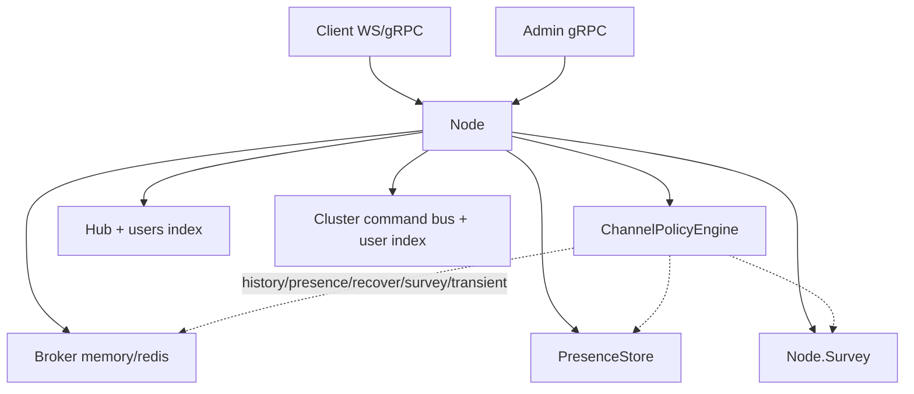
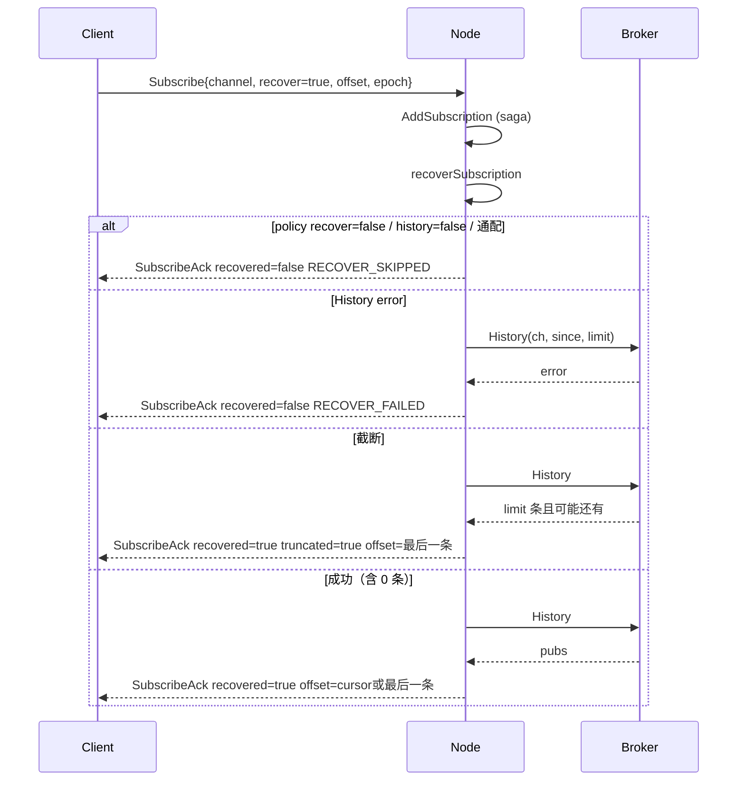
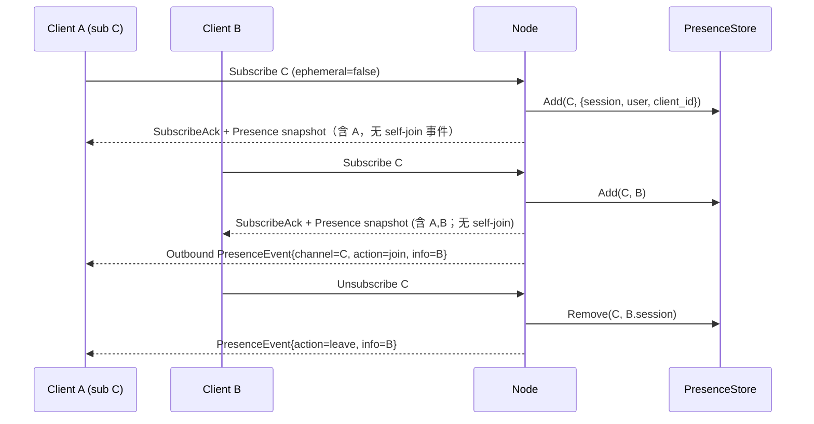
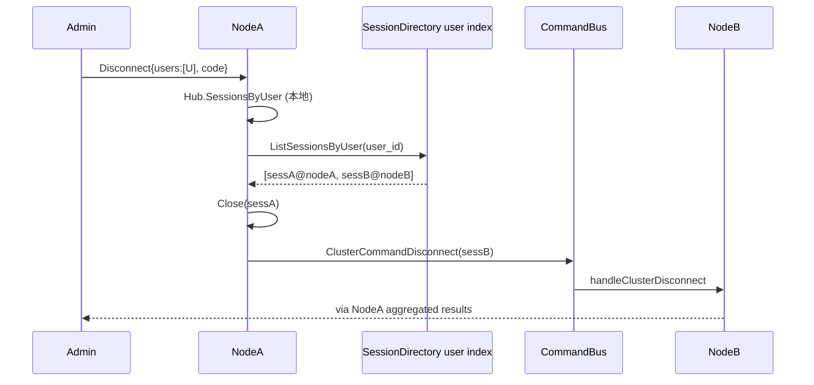
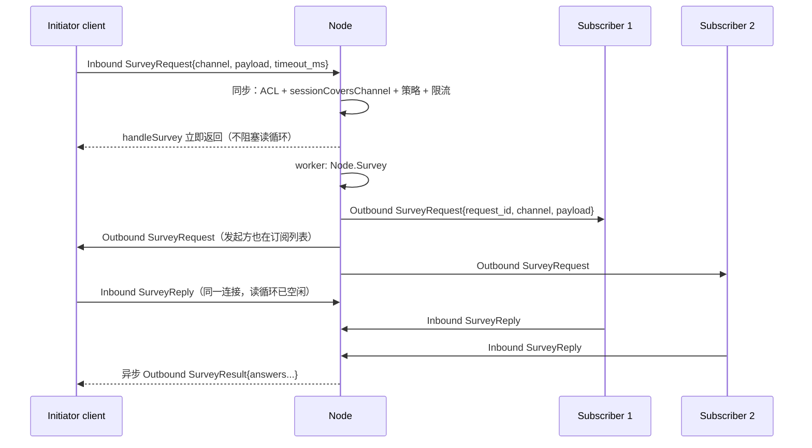
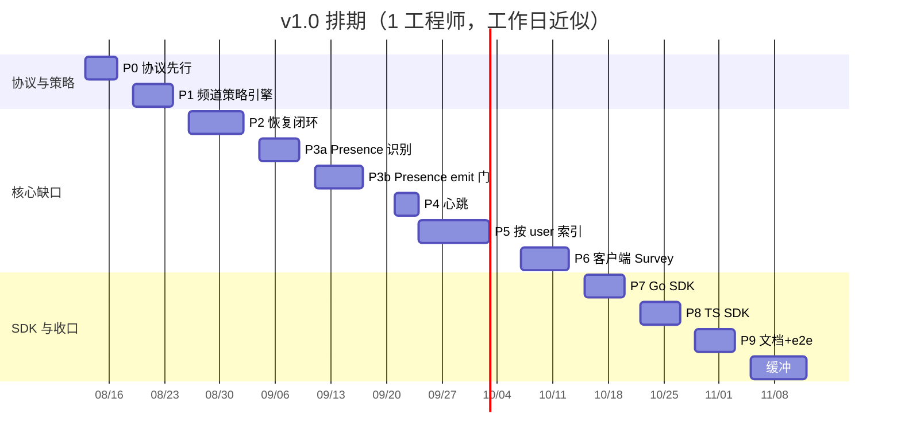
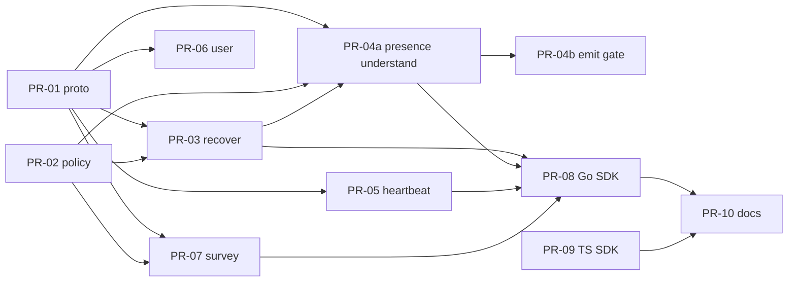

# MessageLoop v1.0 功能缺口设计、ROADMAP 与排期

| 字段 | 值 |
| --- | --- |
| 文档标题 | MessageLoop v1.0 功能缺口设计 + ROADMAP + 排期 |
| 作者 | TBD |
| 日期 | 2026-08-13 |
| 状态 | Approved |
| 仓库路径 | `docs/design/v1.0-platform-gaps.md` |
| 产品路线图 | [`ROADMAP.md`](../../ROADMAP.md) |
| 产品定位 | 双向实时 Messaging Platform（IM / Chat Room / Gaming / IoT）。Centrifugo 仅作参考，不要求协议/API/namespace 语法一致。 |
| 仓库 | `D:\Codes\qiulin\messageloop` |

---

## Overview

MessageLoop 当前（v0.2 preview）已经具备 WebSocket / 客户端 gRPC 双传输、通配订阅、session 级集群 takeover、Admin Survey、PresenceStore 与 Connect 路径的历史恢复。这些是平台差异化能力，v1.0 必须保留并做完整。

但面向 IM / 聊天室 / 对局 / IoT 设备的一等体验仍有七处已拍板的闭环缺口：

1. **Subscribe 路径不恢复**，Connect 恢复失败/截断对客户端不可见。
2. **在场事件没有默认消费者**，客户端做不了在线列表和进出提示。
3. **Admin 只认 session_id**，IM 多端通知/房管踢人缺少按 user 扇出。
4. **心跳默认 300s 且服务端不发 ping**，对局/设备死连接无法秒级发现。
5. **客户端 `SurveyRequest` 名实不符**（echo，不调 `Node.Survey`），游戏 ready-check / IoT 查询做不了。
6. **通配订阅 × presence 自残**：`a.**` 的伴生频道被 `ValidateTopic` 拒绝。
7. **历史/presence/恢复是全局开关**（memory 256 / Redis 10000），一台集群撑不住四场景共用。

本文给出 v0.2 → v1.0 → v1.x 能力地图、每个缺口的协议/服务端/SDK/集群细化设计、验收标准、排期与可独立合并的 PR 计划。协议向后兼容：旧客户端不传新字段时行为可预测；破坏性变更必须有理由和迁移。

---

## Background & Motivation

### 当前能力（v0.2 preview，以源码为准）

| 能力 | 现状 | 关键位置 |
| --- | --- | --- |
| 双传输 | WS `:9080/ws` + 客户端 gRPC `:9090` + Admin gRPC `:9091` + HTTP health/metrics | `docs/developer/01-architecture.md` |
| 通配订阅 | `.` 分层，`*` 单段，末尾 `**` 多段；`ValidateTopic` 拒绝空分段与非末尾 `**` | `pkg/topics/matcher.go:83-112` |
| Connect 恢复 | 仅 `handleConnect` 在 `Recover && Offset > 0` 时调 `broker.History`；History 失败 `continue`；超过 `MaxRecoveredPublications=1000` 静默截断；`Connected` 只有 `resumed` | `client.go:726-805`，`defaults.go:17-20` |
| Subscribe | `handleSubscribe` 完全不读 `Recover`/`Offset`/`Epoch` | `client.go:1136-1209` |
| Presence | `PresenceStore.Add/Remove/Get`；`PresenceInfo.ClientID` 实为 session ID；join/leave 发到 `ch+"/__presence"` transient JSON；文档写明无默认消费者 | `node.go:208-226,845-886`，`docs/protocol.md:367-369` |
| Admin | `Publish`/`Disconnect`/`Subscribe`/`Unsubscribe`/`Survey`/`GetPresence`/`GetHistory`/`GetChannels` 全部按 session 或 channel | `protocol/server/v1/api.proto:12-21`，`pkg/grpcstream/api_handler.go` |
| Hub users | `connShard.users` 仅用于 `max_connections_per_user`，无按 user 查找 API | `hub.go:141-198` |
| 心跳 | `DefaultHeartbeatIdleTimeout=300s`；服务端只按 `lastActivity` 踢人，不发 ping；客户端 SDK 默认 30s 发 Ping | `heartbeat.go`，`node.go:82-95`，`sdks/go/options.go:90-91` |
| Survey | Admin `Node.Survey` 完整（本地 + 集群广播）；客户端 `handleSurvey` 把 payload echo 成 `SurveyReply`，不调 `Node.Survey`；`SurveyRequest` 无 channel | `node.go:590-666`，`client.go:1369-1402`，`protocol/client/v1/service.proto:148-152` |
| 通配 × presence | `presenceChannel("a.**")` = `"a.**/__presence"`，`validTopic` 因中间段含 `**` 拒绝；仅 warning + `PresencePublishFailures` | `docs/review/backlog.md:97`，`pkg/topics/matcher.go:99-112` |
| 历史容量 | 内存环形缓冲固定 256；Redis Stream 全局 `stream_max_length=10000` | `broker_memory.go:13`，`pkg/redisbroker/options.go:19` |
| 集群 | session lease/snapshot、session 定向 command（publish/disconnect/subscribe/unsubscribe/takeover/survey）；**无 user→sessions 索引** | `cluster.go:113-128`，`cluster_commands.go`，`pkg/redisbroker/cluster_directory.go` |

### 痛点（按场景）

- **IM / 聊天室**：断线后动态 Subscribe 拿不到离线消息；进房看不到谁在、看不到进出；系统通知/踢人只能先查 session 再逐个打。
- **Gaming**：300s 才发现死连接，对局状态机无法收敛；ready-check 只能走 Admin Survey，客户端发起是空壳。
- **IoT**：设备重连后 Subscribe 不恢复；秒级掉线发现做不到；按设备 user 扇出指令没有 API。
- **一台集群四场景**：全局 history 256/10000 要么撑爆 Redis（tick 频道），要么 IM 丢历史。

---

## Goals & Non-Goals

### Goals（v1.0 必须闭环）

1. Subscribe 与 Connect **共用**恢复逻辑；成功/失败/截断对客户端可见。
2. 客户端可感知同频道 join/leave，并能拉取当前在场快照；不必自己再订伴生频道。
3. Admin 可按 `user_id` 投递 / 断开 / 订阅，集群下覆盖该 user 在各节点的 session。
4. 心跳可配到秒级；服务端主动 ping，死连接秒级发现。
5. 客户端可对指定 channel 发起 Survey 并收集应答（完整实现，不降级为「仅 admin」）。
6. 通配订阅的 presence 有正式语义，并有测试锁定。
7. 按频道前缀（glob）配置 history / presence / recover / survey / transient，替代全局单一容量。

### Non-Goals（v1.0 不做）

- 抄 Centrifugo 的 `ns:` / `#uid` / `$` 语法。
- HTTP `/api` + 多语言 HTTP 客户端库。
- 内置 JWT/JWKS（继续 proxy token）。
- SSE / 单向传输 / SockJS。
- Fossil delta / map subscriptions / PG broker。
- Admin UI / Helm。
- 一次铺齐 Dart / Swift / Java SDK。
- Last will、发布幂等键：v1.x 预留。
- `PresenceStats` 可作为 v1.x；v1.0 预留 proto 字段，实现不阻塞发版（若顺手可做，但不作为里程碑门禁）。

### 兼容性原则

- proto3 只**加字段 / 加 oneof 分支**，不改号、不删字段、不改旧字段语义（唯一例外见 KD-2：`Recover=true && Offset=0` 在**非 resume 的新鲜 Subscribe/Connect** 上从「跳过」变为「从头恢复」，这是「多给消息」而非「少给消息」。resume 路径缺 `ChannelOffsets` 不得从头倒历史）。
- 旧客户端不传新字段：服务端走旧路径，行为可预测。
- 旧服务端遇到新字段：忽略未知字段（protobuf 默认）。
- 破坏性变更必须写迁移与开关。

---

## ROADMAP

### 能力地图

```mermaid
flowchart LR
  subgraph v02 ["v0.2 preview（当前）"]
    A1[WS + 客户端 gRPC]
    A2[通配 * / **]
    A3[Connect 恢复 / 静默截断]
    A4[PresenceStore + 伴生频道]
    A5[Admin Survey]
    A6[Session 集群 takeover]
  end
  subgraph v10 ["v1.0 闭环"]
    B1[Subscribe + Connect 共用恢复 + recovered]
    B2[一等 Presence 事件 + 快照]
    B3[Publish/Disconnect/Subscribe by user]
    B4[可配 idle + 服务端 ping]
    B5[客户端 Survey + channel]
    B6[通配 presence 正式语义]
    B7[频道前缀策略]
  end
  subgraph v1x ["v1.x"]
    C1[PresenceStats]
    C2[Last will]
    C3[发布幂等键]
    C4[Dart/Swift/Java SDK]
    C5[JWT/JWKS]
    C6[Admin UI / Helm]
  end
  v02 --> v10 --> v1x
```



### v0.2 preview（当前基线）

**已有**

- 客户端直发 Publish / Subscribe / RPC / Ping。
- 通配订阅 + CSTrie。
- Connect 路径历史恢复（有上限、失败静默）。
- Session resume / 集群 takeover（`require_auth` 下才允许 resume）。
- Admin 一元 gRPC（session/channel 粒度）。
- PresenceStore + 伴生频道事件（无默认消费者）。
- Admin Survey（完整）+ 客户端 Survey 回显（空壳）。

**已知缺口**：本文 §v1.0 七项。另见 `docs/review/backlog.md` 第六节第 1 条（presence × `**`）。

**验收（v0.2 保持）**：现有 `go test ./...` 全绿；不回退 session takeover、通配匹配、Admin Survey、payload 类型保持。

### v1.0（本设计范围）

七项缺口全部闭环，Go / TS SDK 能用新协议，文档（protocol / architecture / admin / config / cluster）同步。发版门禁见各缺口验收标准。

### v1.x（预留，不阻塞 v1.0）

| 项 | 预留方式 |
| --- | --- |
| PresenceStats | 客户端/Admin proto 预留 message；v1.0 可不实现 handler |
| Last will | ChannelPolicy 预留 `last_will` 注释，不实现 |
| 发布幂等键 | `Publish` 预留 `idempotency_key` 字段号（见协议提案），服务端忽略 |
| JWT/JWKS | 继续 proxy `$authenticate` |
| 更多 SDK / UI / Helm | 独立仓库或后续里程碑 |

---

## Proposed Design

### 总架构增量



所有新行为先查 `ChannelPolicyEngine`（缺口 7），再走现有 `broker.History` / `PresenceStore` / `Hub.users` / `Node.Survey` / command bus。不引入第二套 matcher，不改 `ValidateTopic` 的 `**` 规则。

---

### 缺口 1 — Subscribe 路径恢复 + 显式 `recovered`

#### 现状（行号级）

`handleConnect` 恢复块（`client.go:726-792`）：

```go
if sub.Recover && sub.Offset > 0 {
    sinceOffset := sub.Offset + 1
    // ... epoch / resumeSnapshot.ChannelOffsets ...
    historyPubs, err := c.node.broker.History(sub.Channel, sinceOffset, 0)
    if err != nil {
        log.WarnContext(ctx, "failed to recover messages", ...)
        continue // 静默跳过
    }
    for _, pub := range historyPubs {
        if len(pubs) >= MaxRecoveredPublications { // 1000
            log.WarnContext(ctx, "recovery truncated", ...)
            break
        }
        pubs = append(pubs, ...)
    }
}
// Connected 只有 Resumed / Epoch / Publications，没有 recovered / truncated
```

`handleSubscribe`（`client.go:1136-1209`）在 `AddSubscription` + presence join 后直接回 `SubscribeAck{Subscriptions: subs}`，零恢复。

协议侧 `Subscription` 已有 `offset` / `recover` / `epoch`（`protocol/client/v1/service.proto:72-78`），`docs/protocol.md:169-171` 也写了这些字段，但 Subscribe 路径未实现——文档超前于代码。

#### 设计



抽取单一恢复函数，Connect 与 Subscribe 共用：

```go
// recover.go（新文件，根包）
type RecoverStatus int

const (
    RecoverSkipped     RecoverStatus = iota // recover=false，或策略禁止
    RecoverOK                               // History 成功（含 0 条）
    RecoverTruncated                        // 命中 MaxRecoveredPublications 或策略 cap
    RecoverFailed                           // History 返回 error
    RecoverEpochReset                       // epoch 不匹配，已从头恢复
)

type ChannelRecovery struct {
    Channel      string
    Status       RecoverStatus
    Publications []*clientpb.Publication
    Offset       uint64 // 见下方「offset 游标规则」；空批回显 cursor，禁止用 0 抹掉已知位置
    Epoch        string
    Err          error
}

func (n *Node) recoverSubscription(
    ctx context.Context,
    sub *clientpb.Subscription,
    snapshot *ClusterSessionSnapshot, // nil = 非 resume
    resume bool,
) ChannelRecovery
```

算法（与现网 Connect 对齐，并修静默 / resume 倒历史 / 无历史假装追上）：

1. **Skip 门**（不调用 `History`）→ `RecoverSkipped`：
   - `!sub.Recover`
   - 策略 `recover=false` **或** `history=false` **或** `transient_only=true`（`History` 对禁用历史返回空切片而非 error，`broker.go:118-121`；若当 `RecoverOK` 客户端会以为追上了）
   - 通配频道（`hub.isWildcard`；历史按精确频道存；见 Open Questions Q1）
   - 客户端 `recover=true` 却被策略/通配拒绝时，`RecoverResult.error.code=RECOVER_SKIPPED`
2. **游标 `cursor`（客户端最后已知 offset）与 `sinceOffset`**：
   - **resume 路径**（`resumeSnapshot != nil`）：
     - `ChannelOffsets[ch]` 存在且 `snapshot.BrokerEpoch == currentEpoch` → `cursor = serverOffset`，`sinceOffset = cursor+1`（沿用 `client.go:733-747`）。
     - `ChannelOffsets[ch]` 存在且 epoch 不匹配 → `RecoverEpochReset`，`cursor = 0`，`sinceOffset = 0`。
     - **`ChannelOffsets[ch]` 缺失 → `RecoverSkipped`，不得按 KD-2 从头倒流**（快照故意省略「从未投递过历史」的频道，`cluster_state.go:72-75`）。
   - **非 resume（新鲜 Connect/Subscribe）**：
     - `currentEpoch != "" && sub.Epoch != "" && sub.Epoch != currentEpoch` → `RecoverEpochReset`，`sinceOffset = 0`，`cursor = 0`。
     - 否则若 `sub.Offset == 0` → `sinceOffset = 0`，`cursor = 0`（KD-2，**仅此路径**）。
     - 否则 `cursor = sub.Offset`，`sinceOffset = sub.Offset+1`。
3. `limit = min(DefaultHistoryLimit, policy.RecoverLimit or MaxRecoveredPublications, remainingCap)`。`remainingCap` 是本次 **Connect 或 Subscribe 请求** 剩余的全局 `MaxRecoveredPublications` 配额。今日 Connect 已对每个频道 `History(..., 0)` 再被 `DefaultHistoryLimit=1000` 封顶，请求级 cap 仍是多频道总和的改进。
4. `broker.History(ch, sinceOffset, limit)`：
   - error → `RecoverFailed`，**不得** `continue` 吞掉。
   - 返回条数 == limit 且后端可能还有更多 → `RecoverTruncated`。
   - 否则 `RecoverOK`（0 条也是 OK，表示从这个 cursor 往后没有新消息）。
5. 消息 ID 继续用 `publicationID(channel, offset)`（`hub.go:26-31`），与实时投递去重。

**offset 游标规则（`RecoverResult.offset`）**

| 情况 | `offset` 取值 |
| --- | --- |
| 交付了 ≥1 条（含截断） | **最后一条已交付 publication 的 offset** |
| 空成功（0 条） | **回显 `cursor`**（客户端/快照最后已知位置）。禁止填 0，除非 `cursor` 本来就是 0 |
| Skipped / Failed | 回显 `cursor`（未前进） |

**Resume 额外义务**：`restoreSessionSubscriptions` 之后，恢复循环的频道集合 = `union(connect.Subscriptions, snapshot.Subscriptions)`。快照里有、Connect 未列出的频道用 `ChannelOffsets` 续读；缺 offset 的跳过（上表），不得从头倒。

**Re-subscribe**：对已订阅频道再次 Subscribe 且 `recover=true` = **合法 catch-up**（不当 no-op），走同一 helper。

**可见性（禁止静默）**

| 结果 | 客户端看到什么 |
| --- | --- |
| OK，N 条 | `recovered=true`，`publications` 含 N 条，`offset` 为最后一条 |
| OK，0 条 | `recovered=true`，空 publications，`offset=cursor`（明确「从这个位置追上了」） |
| Truncated | `recovered=true`，`truncated=true`，`offset` 为最后交付；客户端可再用该 offset 发下一次 Subscribe |
| Failed | `recovered=false`，`error.code=RECOVER_FAILED`；**订阅仍然成功**（否则 IM 会因 History 抖动进不了房） |
| Skipped | `recovered=false`；若客户端要了 recover 则带 `RECOVER_SKIPPED`，否则无 error |

Connect 的 `Connected` 增加聚合字段：任一频道 Truncated/Failed 必须在 `recover_results` 里逐频道可见；`resumed` 语义不变（会话接管成功）。

#### 协议提案（additive）

```protobuf
// protocol/client/v1/service.proto 提案

message RecoverResult {            // 新 message
  string channel = 1;
  bool recovered = 2;              // History 调用成功（含 0 条）
  bool truncated = 3;              // 命中 cap，后面还有
  uint64 offset = 4;               // 有消息=最后一条；空批=回显 cursor
  string epoch = 5;
  messageloop.shared.v1.Error error = 6; // RECOVER_FAILED / RECOVER_SKIPPED
}

message Connected {
  string session_id = 1;
  repeated Subscription subscriptions = 2;
  repeated Publication publications = 3;
  bool resumed = 4;
  string epoch = 5;
  bool recovered = 6;                      // 新增：至少一个频道 recovered=true
  bool truncated = 7;                      // 新增：至少一个频道 truncated
  repeated RecoverResult recover_results = 8; // 新增
  repeated PresenceSnapshot presence = 9;  // 新增：精确频道在场快照（见缺口 2）
}

message SubscribeAck {
  repeated Subscription subscriptions = 1; // 保持：成功订阅的频道（含未恢复的）
  repeated Publication publications = 2;   // 新增：本批恢复消息
  repeated RecoverResult recover_results = 3; // 新增
  string epoch = 4;                        // 新增：当前 broker epoch
  repeated PresenceSnapshot presence = 5;  // 新增：本批精确频道快照
}
```

错误码（`shared.v1.Error.code`，字符串，沿用现有信封）：

| code | type | 何时 |
| --- | --- | --- |
| `RECOVER_FAILED` | `recover_error` | `broker.History` error |
| `RECOVER_SKIPPED` | `recover_error` | 仅当客户端 `recover=true` 但策略/通配拒绝时，写在 `RecoverResult.error`，不是顶层 Error |

不引入新的 Disconnect code。恢复失败不断连。

#### 服务端改动点

| 文件 | 改动 |
| --- | --- |
| `recover.go`（新） | `recoverSubscription` + 配额累计 |
| `client.go` `handleConnect` | 删除 726-792 内联逻辑，改为调用 helper；填充 `Connected` 新字段 |
| `client.go` `handleSubscribe` | 每频道订阅成功后调用 helper；`SubscribeAck` 带 publications/results |
| `defaults.go` | `MaxRecoveredPublications` 注释改为「单次 Connect/Subscribe 请求的总 cap」，仍默认 1000 |
| `metrics.go` | 见 Observability |
| 测试 | 扩展 `client_test.go` `TestNode_Connect_RecoveryCap`；新增 `TestClient_Subscribe_Recover*`（失败可见、截断可见、epoch mismatch、新鲜 Offset=0 从头、**resume 缺 ChannelOffsets 不从头**、**history=false → Skipped**、re-subscribe catch-up、快照未列出频道仍按 offset 续读） |

#### SDK

- Go：`SubscribeWith` 增加 `WithRecover(offset uint64, epoch string)`；解析 `SubscribeAck.publications` 走与 `Connected.publications` 同一投递路径（`sdks/go/client.go:529-531`）。
- TS：`subscribe(channels, {recover, offset, epoch})`；重连 Subscribe 同样带 recover（今日重连只在 Connect 带，动态 subscribe 不带）。

#### 集群

不新增 command。跨节点 resume 仍用 `ClusterSessionSnapshot.ChannelOffsets`（已实现，`cluster_state.go:67-76`）。Subscribe 路径的恢复只读本节点 broker（Redis 下历史是共享的，正确）。

#### 兼容性

- 旧客户端不设 `recover`：两边都 `RecoverSkipped`，与今日 Subscribe 行为一致。
- 旧客户端只认 `SubscribeAck.subscriptions`：新字段被忽略，订阅仍成功；恢复消息丢失——旧客户端本就不消费 Subscribe 恢复。文档写明「要恢复必须升级 SDK」。
- KD-2 行为变化**只**影响「非 resume 的新鲜 Subscribe/Connect 且 `recover=true` 且 `offset=0`」：今日跳过，v1.0 从头恢复。TS 重连走 resume 时 `recover: isReconnecting` 且 `offset` 常为 0（`sdks/ts/src/client/client.ts:709-715`）——**resume 缺 `ChannelOffsets` 必须 Skipped**，否则每次接管倒 1000 条。新鲜动态 Subscribe（无 snapshot）才享受「offset=0 从头」。

#### 备选与取舍

| 方案 | 优点 | 缺点 | 结论 |
| --- | --- | --- | --- |
| **A. 共用 helper + Ack 内嵌 publications + RecoverResult（采用）** | 一次 RTT；与 Connect 对称；失败可见 | Ack 可能变大 | 采用。cap 1000 + 截断标志 |
| B. Subscribe 成功后客户端再调 Admin GetHistory | 服务端改动小 | 客户端协议无 History；Admin 有鉴权边界；多一跳 | 否。客户端直发是一等能力 |
| C. 恢复失败则整次 Subscribe 失败 | 实现简单 | History 抖动导致进不了房 | 否。订阅与恢复解耦 |

#### 风险

| 风险 | 严重度 | 缓解 |
| --- | --- | --- |
| Connect 信封过大（多频道 × 1000） | 中 | 维持全局 1000 cap；超限 `truncated=true`；后续 Subscribe 续拉 |
| Offset=0 从头恢复打爆内存 broker | 中 | 策略 `recover_limit`；默认仍 1000 |
| 与实时 Publication 竞态重复 | 低 | 稳定 ID `channel-offset`，SDK 已按 ID 去重 |

#### 验收标准

1. **Given** 频道有 offset 1..10，客户端 Subscribe `recover=true, offset=5, epoch=当前`。**When** 订阅成功。**Then** `SubscribeAck.recover_results[ch].recovered=true`，publications 含 offset 6..10，ID 为 `ch-6`…`ch-10`。
2. **Given** `broker.History` 返回 error。**When** Subscribe `recover=true, offset=1`。**Then** 订阅成功（频道在 hub 中），`recovered=false`，`error.code=RECOVER_FAILED`；**没有**静默空 Ack。
3. **Given** 历史 2000 条。**When** Connect/Subscribe recover 从头。**Then** 最多 1000 条，`truncated=true`，`offset` 为第 1000 条；指标 `messageloop_recovery_truncated_total` +1。
4. **Given** `recover=false`。**When** Subscribe。**Then** 不调 History，`recovered=false` 且无 error。
5. **Given** 通配 `im.**` 且 `recover=true`。**When** Subscribe。**Then** 订阅成功，该频道 `RecoverSkipped`（result 可见，`RECOVER_SKIPPED`），不调用 History。
6. **Given** 策略 `history=false` 或 `transient_only`（如 `game.tick.**`），客户端 `recover=true`。**When** Subscribe。**Then** `RecoverSkipped` + `RECOVER_SKIPPED`，**不**调用 History，**不**返回 `recovered=true`。
7. **Given** resume 快照无 `ChannelOffsets[ch]`，客户端 `recover=true, offset=0`。**When** Connect。**Then** 该频道 `RecoverSkipped`，Connected 中**没有**该频道的 1000 条倒流。
8. **Given** resume 快照有 `ChannelOffsets[ch]=5` 且 epoch 匹配，Connect.Subscriptions 未列出 ch。**When** Connect。**Then** 仍从 offset 6 续读 ch。
9. **Given** 已订阅 ch，再 Subscribe `recover=true, offset=5`。**When** 历史有 6..8。**Then** catch-up 成功，publications 含 6..8。
10. **Given** `recover=true, offset=5`，History 返回空。**When** Subscribe 成功。**Then** `recovered=true`，`offset=5`（回显 cursor），不是 0。

---

### 缺口 2 — 客户端可感知在场

#### 现状

- `SetPresenceForSession` 把 `ClientID: c.SessionID()` 写入 store（`node.go:213-217`）。Admin `GetPresence` 把这个值填进 `PresenceInfo.client_id`（`api_handler.go:208-214`）。**协议字段名是 client_id，语义是 session_id。**
- join/leave：`PublishPresenceJoin/Leave` → `presenceChannel(ch)=ch+"/__presence"` → `PublishTransient`（`node.go:845-886`）。
- `docs/protocol.md:367-369` 原文：「`__presence` sub-channel currently has **no consumer**」。
- `ephemeral=true` 不登记、不发事件（`client.go:712-723,1180-1191`）。
- 客户端协议没有 Presence / PresenceStats 信封。

#### 设计（一等 Presence，而不是「自动订伴生频道」）

**原则**：订阅了频道 `C` 的客户端，默认就能收到 `C` 上的 join/leave，并能主动拉快照。不要求再订 `C/__presence`。伴生频道降为可选兼容通道（策略开关，默认关）。



**投递路径（专用，不复用 `broadcastPublication`）**

`broadcastPublication` / `GetMatchingSubscribers` 只返回 `*Client`，**已经会投递给 ephemeral**（ephemeral 只跳过 PresenceStore），且会 `MessagesDelivered++`。Presence 必须自己走路：

```go
// node.go
func (n *Node) deliverPresenceEvent(ch string, evt *clientpb.PresenceEvent)
```

1. 精确分片：遍历 `subShard.subs[ch]`，读 `Subscriber.Ephemeral`。
2. 通配：`matcher.Lookup(ch)` 得到 `Subscriber`（带 `Ephemeral`）。
3. 按 session 去重；**`Ephemeral == true` 跳过**。
4. 写 `OutboundMessage.presence_event`。
5. **不**增加 `MessagesDelivered`；失败记 `presence_failures_total{op=deliver}`。
6. 若策略 `legacy_presence_channel=true` **且** `!isWildcard(ch)`，再 `PublishTransient(presenceChannel(ch), json)`。

通配订阅者 B 订了 `im.**`，A 加入精确频道 `im.room.1`：B 通过步骤 2 收到 `PresenceEvent{channel:"im.room.1"}`。这是缺口 6 的正解。

**所有写 presence 的入口都必须跳过通配 pattern**（不得 `SetPresence` / join / leave / 伴生发布）：

| 入口 | 今日 | v1.0 |
| --- | --- | --- |
| `handleConnect` | 非 ephemeral 就 Add+join | 再加 `!isWildcard` |
| `handleSubscribe` | 同上 | 同上 |
| `handleUnsubscribe` / `close()` | 非 ephemeral 就 Remove+leave | 通配无 store 记录，skip |
| `refreshPresence` | 跳过 ephemeral | 再跳过 wildcard |
| `restoreSessionSubscriptions`（`cluster_resume.go:146-150`） | 每个非 ephemeral **含 pattern** 都 `SetPresence` | `!Ephemeral && !isWildcard` |
| `handleClusterSubscribe` | 非 already 就 Set+join | 同上 |

**规范顺序（self-join）**：先 `PresenceStore.Add`，再给**加入者**快照（快照含自己），**不**给加入者发 self-join 事件；再给**已在场成员**（不含加入者）发 `PresenceEvent{join}`。Leave：先 Remove，再给剩余成员发 leave。

**鉴权：`sessionCoversChannel`，不是 `hasSubscription`，也不是单独 `CanSubscribe`**

`hasSubscription`（`client.go:1483-1488`）只认 `subscribedChannels` 的精确键。订了 `chat.**` 的客户端 `hasSubscription("chat.room.1")==false`，但按缺口 2/6 他**会**收到该房事件。

```go
// sessionCoversChannel reports whether this session may see presence / start
// a client survey on exact channel ch.
func (c *Client) sessionCoversChannel(ch string) bool {
    if c.hasSubscription(ch) {
        return true
    }
    for pattern := range c.subscribedChannels { // 持锁拷贝后迭代
        if isWildcard(pattern) && topicsMatch(pattern, ch) { // 复用 matcher 语义
            return true
        }
    }
    return false
}
```

PresenceQuery 与客户端 Survey **同时**要求：

1. `sessionCoversChannel(ch)`（精确或通配命中）
2. 频道策略允许（presence / survey）
3. 内置 ACL（Survey 用 `CanSurvey`，Presence 用 `CanSubscribe`）

**禁止**只用 `CanSubscribe`：ACL `*` 时会允许偷看未加入的房间。拒绝时统一顶层 Error **`PERMISSION_DENIED`**（`type=acl_error`），不再混用 `ACL_DENIED`。

**快照上限**：`PresenceStore.Get` 全量物化，万人房 + 1000 条恢复会打爆 `MaxMessageSize`（默认 64KB）。

- 常量 `MaxPresenceSnapshotClients = 256`（策略可覆盖 `presence_snapshot_limit`）。
- `PresenceSnapshot`：`clients` 最多 N 条；超出则 `truncated=true`，填 `occupancy`（store 总人数），客户端再发 `PresenceQuery`。
- Connect/SubscribeAck 对每个精确频道各带一份；总占用过大时优先截断 clients、保留 occupancy。
- `PresenceQuery` 同样受 N 封顶（v1.0 不分页）。

**主动查询（客户端）**

```protobuf
// Inbound oneof 新增（完整字段号见「API / Interface Changes」总表）
PresenceQuery presence_query = 12;
// reserved 13 for PresenceStatsQuery (v1.x)

// Outbound oneof 新增
PresenceSnapshot presence = 14;
PresenceEvent presence_event = 15;
// reserved 16 for PresenceStats (v1.x)

message PresenceQuery {
  string channel = 1; // 必须是精确频道
}

message PresenceInfo {
  string session_id = 1;
  string user_id = 2;
  string client_id = 3;     // Connect.client_id，设备/端标识
  int64 connected_at = 4;
}

message PresenceSnapshot {
  string channel = 1;
  repeated PresenceInfo clients = 2;
  bool truncated = 3;       // 超出 snapshot cap
  int32 occupancy = 4;      // store 中的总人数（含未放入 clients 的）
}

message PresenceEvent {
  string channel = 1;       // 始终是精确频道名
  string action = 2;        // "join" | "leave"
  PresenceInfo info = 3;
  // reserved 4 for occupancy (v1.x)
}
```

**Admin `PresenceInfo` 兼容**：保留 field 1 `client_id`（继续填 session ID，避免已有运维脚本崩），新增：

```protobuf
message PresenceInfo { // server.v1
  string client_id = 1;     // 兼容：仍为 session ID
  string user_id = 2;
  int64 connected_at = 3;
  string session_id = 4;    // 新增：与 client_id 相同，正式名
  string connect_client_id = 5; // 新增：Connect.client_id
}
```

**store 结构**：`PresenceInfo`（Go）扩展 `SessionID`、`ConnectClientID`；`ClientID` 字段继续等于 session ID 一个小版本，避免 Redis JSON 不兼容。`PresenceStore` 接口方法签名不变（仍按 `clientID` 即 session 增删）。

#### 服务端改动点

| 文件 | 改动 |
| --- | --- |
| `presence.go` | `PresenceInfo` 加字段；注释写明 ClientID==session |
| `presence_event.go` | 增加 proto 映射；JSON 伴生格式保留给 legacy |
| `node.go` | `emitPresence`：Phase 1 只 `deliverPresenceEvent`；Phase 2 **只** `PublishTransient`（禁止两者叠用）。`deliverPresenceEvent` 跳过 ephemeral、不 `MessagesDelivered++` |
| `hub.go` | broadcast 识别 `ml.type=presence` → 改写/丢弃，不当 publication |
| `client.go` | 快照+Query；所有 writer 跳过通配 |
| `cluster_resume.go` / `cluster_commands.go` | restore / cluster subscribe 不对 pattern `SetPresence` |
| `acl.go` | PresenceQuery 用 `sessionCoversChannel`，不是单独 CanSubscribe |
| `pkg/grpcstream/api_handler.go` | GetPresence 填新字段 |
| `pkg/redisbroker/presence_redis.go` | JSON 多两个字段，旧数据缺省为空 |

#### SDK

- Go/TS：`OnPresence(fn)`；`Presence(ctx, channel)` 发查询；Connect/SubscribeAck 快照回调一次。
- 默认**不再**自动订阅 `*/__presence`。

#### 集群

Redis PresenceStore 已按频道聚合（`pkg/redisbroker/presence_redis.go`）。一等事件只投递给**本节点** `GetMatchingSubscribers`；其他节点的订阅者通过现有 Redis Pub/Sub 收不到一等信封。

**必须**：集群下 join/leave 也要到其他节点。Redis 已 `PSubscribe(ml:pubsub:*)` 并把精确频道扇到对本 pattern 感兴趣的节点（`pkg/redisbroker/pubsub.go:103-157`，`interested()` at `redis.go:199-208`）。在精确业务频道上 `PublishTransient` + `Metadata["ml.type"]="presence"`，对端节点只有**改写/丢弃**后才安全。

**两阶段发布（KD-16）——每个节点只走一条投递路径**

旧节点 `broadcastPublication`（`hub.go:329-376`）会把任何 transient 编成 `OutboundMessage.publication`。新节点若立刻 emit，滚动升级期间旧节点上的客户端会把 join 当成业务消息。

更致命的是 **Phase 2 禁止「先 `deliverPresenceEvent` 再 `PublishTransient`」**：

- 内存 broker 的 `PublishTransient` 同步调 Start handler（`broker_memory.go:157-168`）→ 再走一遍 rewrite。
- Redis `PublishTransient` 只 `PUBLISH`（`pkg/redisbroker/redis.go:282-304`），但本进程已 `PSubscribe(ml:pubsub:*)`；`deliverOnce` 对 **offset 0 无去重**（`pubsub.go:258-261`：「Transient publications … deliver unconditionally」）。

叠用会让本节点每个订阅者收到两次 join/leave，对端只有一次。presence 事件无稳定 ID，客户端无法去重。

| 阶段 | 配置 | **唯一**投递路径 |
| --- | --- | --- |
| **Phase 1（PR-04a，默认）** | `cluster_emit: false` | **只** `deliverPresenceEvent`（本节点精确+通配、跳过 ephemeral）。**不** `PublishTransient`。同时：`broadcastPublication` 必须能识别 `ml.type=presence` 并改写/丢弃（为 Phase 2 做准备，本阶段不会见到这种帧）。 |
| **Phase 2（PR-04b，舰队齐后）** | `cluster_emit: true` | **只** `PublishTransient(exactCh, {ml.type=presence})`。**不再**调 `deliverPresenceEvent`。本节点与对端一律经 broker → `broadcastPublication` 改写为一等信封。 |

```go
func (n *Node) emitPresence(ch string, evt *clientpb.PresenceEvent) {
    if n.presenceClusterEmit() { // 配置 cluster_emit
        _ = n.PublishTransient(ch, presencePublication(evt))
        return
    }
    n.deliverPresenceEvent(ch, evt)
}
```

`broadcastPublication` 的 presence 分支：跳过 ephemeral、**不** `MessagesDelivered++`、写出 `presence_event`。与 `deliverPresenceEvent` 同一套过滤。

门闩默认关；运维在全部进程升级后再打开。单节点 / `cluster.enabled=false` 且 `cluster_emit=false` 只走 `deliverPresenceEvent`。`PublishTransient` 不进 History（`broker.go:111-116`），不记 `DeliveredOffset`。伴生频道默认不写。

#### 备选与取舍

| 方案 | 优点 | 缺点 | 结论 |
| --- | --- | --- | --- |
| **A. 一等信封 + 两阶段且每阶段单路径（采用）** | 通配命中；混部安全；无双投 | 跨节点要等 Phase 2 | 采用 |
| B. 自动订阅伴生频道 | 改动面小 | 通配非法；客户端要订两个频道；文档已承认无消费者 | 否，作为 `legacy_presence_channel` 可选 |
| C. 仅主动查询，无 push | 实现最小 | 聊天室进出提示要轮询 | 否，不满足「进出提示」 |

#### 风险

| 风险 | 严重度 | 缓解 |
| --- | --- | --- |
| 大频道 join 风暴（万人房） | 高 | 策略 `presence=false` 关；扇出走现有 `broadcastParallelLimit=64` |
| 旧节点把 presence transient 当业务消息 | 高 | **Phase 1 默认不 emit**；升级节点先学会 drop/rewrite（PR-04a） |
| 旧客户端把 presence 当聊天 | 中 | 默认不写伴生频道；一等信封旧客户端忽略；Phase 2 后新客户端才跨节点收事件 |
| ClientID 语义混乱 | 中 | 双字段 + 文档；SDK 只暴露 `sessionId`/`clientId`/`userId` |

#### 验收标准

1. **Given** A 已订 `chat.room.1`。**When** B Subscribe 同一频道。**Then** A 收到 `PresenceEvent{action=join, info.session_id=B, info.user_id=B.user, info.client_id=B.client}`；B 的 `SubscribeAck.presence` 含 A 与 B。
2. **Given** A 订 `chat.**`。**When** B 加入 `chat.room.1`。**Then** A 收到 `PresenceEvent{channel=chat.room.1, action=join}`（缺口 6 一起验）。
3. **Given** ephemeral 订阅。**When** Subscribe。**Then** store 无记录，无人收到 join。
4. **Given** 客户端发 `PresenceQuery{channel}`。**When** `sessionCoversChannel`（精确或通配命中）且策略允许。**Then** 返回快照；仅 ACL 允许但未覆盖该频道 → **`PERMISSION_DENIED`**（不能偷看）。
5. **Given** 无人订阅 `__presence` 伴生频道。**When** join/leave。**Then** 不出现 `PresencePublishFailures`（不再走非法伴生）。
6. **Given** 房间 500 人，`presence_snapshot_limit=256`。**When** Subscribe。**Then** `presence[0].truncated=true`，`occupancy=500`，`len(clients)<=256`；加入者**没有**收到 self-join 事件。
7. **Given** 混部：node-old 未识别 `ml.type`，`cluster_emit=true`。**When** node-new join。**Then** 这是禁止的运维状态；Phase 1 默认 `cluster_emit=false` 时 node-old **收不到**伪聊天。单测：broadcast 遇到 `ml.type=presence` 不得产出 `publication` 信封。
8. **Given** ephemeral 或通配 pattern。**When** `restoreSessionSubscriptions` / `handleClusterSubscribe`。**Then** 不对 pattern 调 `SetPresence`。
9. **Given** `cluster_emit=true`，同节点两个订阅者。**When** 第三人 join。**Then** 两个本地订阅者**各恰好 1 条** `PresenceEvent`（内存 broker 与 Redis 各一条测试）；不得 `deliverPresenceEvent` + `PublishTransient` 叠用。

---

### 缺口 3 — 按 user 投递 / 断开 / 订阅

#### 现状

- Admin `DisconnectRequest.sessions`、`SubscribeRequest.session_id`、`Publication.Destination.sessions/channels`（`protocol/server/v1/api.proto:29-32,72-87`）。
- `Hub.connShard.users map[userID]map[sessionID]struct{}` 只服务于 `maxConnsPerUser`（`hub.go:156-177`），**没有** `SessionsByUser`。
- 集群 `SessionDirectory` 只有 session 键（`ml:cluster:session:lease:{id}`），lease JSON 里有 `UserID` 但不建反向索引（`cluster_state.go:39-50`，`cluster_directory.go:43-48`）。
- 跨节点 session 操作已通：`PublishToSession` / `DisconnectSession` / `SubscribeSession`（`cluster_commands.go:26-88`）。

#### 设计



**本地索引**：`Hub.SessionsByUser(userID) []*Client`，遍历 `connShards[index(userID)]`（user 已按 `index(userID)` 分片，`hub.go:161-176`）。空 userID 的匿名连接：不进入按 user API（返回空）。

**集群索引**（扩展 `SessionDirectory`，additive）。今日接口只有 Put/Get/CAS/Delete lease+snapshot（`cluster.go:63-74`），**没有 List**。现有投影修复只修频道 owner 投影（`cluster_projection_repair.go`），不能用来重建 user 集。

```go
// cluster.go SessionDirectory 新增
AddUserSession(ctx context.Context, userID, sessionID string, ttl time.Duration) error
RemoveUserSession(ctx context.Context, userID, sessionID string) error
ListUserSessions(ctx context.Context, userID string) ([]string, error)
```

**单一 helper，Put / CAS / Delete 都走它**（resume 用 `CompareAndSwapSessionLease`，`cluster_resume.go:72`，只钩 Put/Delete 会漏）：

```go
func syncUserIndex(ctx, dir, oldLease, newLease) error {
    // Delete / CAS 失败回滚：RemoveUserSession(old.UserID, session)
    // Put / CAS 成功：若 user 变了，SREM old + SADD new；否则 refresh member TTL
}
```

`handleConnect` 在 resume 后 `authUser` 覆盖继承 user（`client.go:541-550,597-599`），`ReplaceSession` 已迁移 `connShard.users`（`hub.go:670-697`）。Redis 必须 **SREM 旧 user / SADD 新 user**，由 helper 比较 `oldLease.UserID` vs `newLease.UserID`。

**键设计（避免单 SET+EXPIRE 无法按 session TTL）**：对齐 Presence 的「成员键 + 索引」（`presence_redis.go:57-70`）：

- `ml:cluster:user:member:{userID}:{sessionID}` — 与 session lease 相同 TTL，续期时 `EXPIRE`
- `ml:cluster:user:sessions:{userID}` — Set；成员过期靠 repair 修剪

接受短暂 stale member，**展开时必须过滤**（见下）。不把索引当权威。

**修复**：新循环 `SCAN ml:cluster:session:lease:*`（`cluster_query_store.go` 已有 `scanKeys`），按 lease JSON 重建 user 成员键。**不要**挂在频道投影修复上。

**展开（KD-13，始终校验，不是 Open Question）**：

```
sessions = union(Hub.SessionsByUser(user), ListUserSessions(user))
for sid in sessions {
    lease = GetSessionLease(sid)   // 本地 client 则用 client.UserID()
    if lease == nil || lease.UserID != requestedUser { skip }  // 投毒/过期
    dispatchSessionCommand(sid, ...)
}
```

索引缺失窗口**不**做全集群 SCAN（热路径）；靠 repair 收敛。结果 map 按 session 返回。空 `user_id` → `InvalidArgument`。

**Admin proto：只扩展现有消息，不加专用 RPC**（Unsubscribe 与 Subscribe 对称；避免实现只做一半）：

```protobuf
message Destination {
  repeated string sessions = 1;
  repeated string channels = 2;
  repeated string users = 3;          // 新增
}

message DisconnectRequest {
  repeated string sessions = 1;
  uint32 code = 2;
  string reason = 3;
  repeated string users = 4;          // 新增
}

message SubscribeRequest {
  string session_id = 1;
  repeated string channels = 2;
  string user_id = 3;                 // 新增：与 session_id 并集；都空 → InvalidArgument
}

message UnsubscribeRequest {
  string session_id = 1;
  repeated string channels = 2;
  string user_id = 3;                 // 新增，与 Subscribe 对称
}
```

不新增 `DisconnectUser` / `SubscribeUser` RPC。`PublishResponse` 仍为空：按 user 扇出的失败语义与今日 session publish 相同——**best-effort**，全失败才 `Internal`（`api_handler.go:28-30,93-95`）。Disconnect/Subscribe 的 `map<string,bool>` 已能按 session 报结果。

实现：展开 users → sessions → 现有 `PublishToSession` / `DisconnectSession` / `SubscribeSession` / `UnsubscribeSession`。

**鉴权**：沿用 Admin Bearer（`config.go:204-209`，`adminAuthInterceptor`）。不把按 user 操作暴露给客户端协议。集群 command 只在节点间走 Redis 总线（信任边界 = 共享 Redis + 内网）。

**Subscribe by user 的 ACL**：继续 `AdminCanSubscribe(channel)` + `adminPrincipal`（`cluster_commands.go:56-97`）。

#### 服务端改动点

| 文件 | 改动 |
| --- | --- |
| `hub.go` | `SessionsByUser` |
| `cluster.go` | SessionDirectory 三方法；noop 空实现 |
| `pkg/redisbroker/cluster_directory.go` | per-session 成员键 + Set；`syncUserIndex` |
| `cluster_state.go` / `cluster_resume.go` | Put、CAS、Delete 都调 helper；user 变更搬迁 |
| `cluster_commands.go` | `expandUserSessions`（含 lease.UserID 校验） |
| `pkg/grpcstream/api_handler.go` | `Destination.users`；`Disconnect.users`；Subscribe/Unsubscribe `user_id` |
| 新 `cluster_user_index_repair.go` 或修器扩展 | `SCAN` lease 前缀重建，不复用频道投影循环 |

不新增 `ClusterCommandPublishToUser`（展开后复用 session command）。

#### SDK

服务端能力；客户端 SDK 不改。Go 管理侧若以后有 admin client 再包一层。文档 `docs/developer/03-admin-api.md` 必更。

#### 备选与取舍

| 方案 | 优点 | 缺点 | 结论 |
| --- | --- | --- | --- |
| **A. user→sessions 索引 + 复用 session command（采用）** | 结果按 session；复用 takeover 路径 | 索引要修 | 采用 |
| B. 新 `ClusterCommandDisconnectUser` 广播到所有节点 | 无索引 | 每节点扫本地 users；N 节点都处理，O(nodes) 固定开销可接受 | 拒绝作主路径；可作为索引 miss 的 **可选** fallback（默认关） |
| C. 客户端协议加 `PublishToUser` | IM 方便 | 任意客户端可骚扰同 user 其他端；放大 | 否。只走 Admin |

#### 风险

| 风险 | 严重度 | 缓解 |
| --- | --- | --- |
| 索引与 lease 不一致 | 中 | SCAN lease 修复；展开始终 `GetSessionLease` 校验 UserID；允许部分 false |
| 匿名 user（空 userID）误伤 | 高 | 空 user_id 直接 `InvalidArgument` |
| 大 V 几千 session 扇出 | 中 | 与现有 broadcast 一样限并发；metrics 记扇出大小 |

#### 验收标准

1. **Given** 用户 U 在 nodeA 有 sess1、nodeB 有 sess2。**When** Admin `Disconnect{users:[U]}`。**Then** 两 session 均断开，`results` 两 key 为 true；客户端收到指定 code。
2. **Given** U 两台设备。**When** Admin Publish `destination.users=["U"]`。**Then** 两端都收到 Publication（channel 可空，与今日 session publish 一致，`api_handler.go:56-59`）。部分失败时只要有一条成功，RPC 仍空响应（best-effort）。
3. **Given** `user_id=""`。**When** 任一按 user 字段。**Then** gRPC `InvalidArgument`，不扫描。
4. **Given** 无 Admin token。**When** 调用。**Then** `Unauthenticated`（现有拦截器）。
5. **Given** 单节点、无 cluster。**When** Publish `destination.users`。**Then** 仅展开本地 `SessionsByUser`，不要求 Redis 索引。
6. **Given** 索引里有 sid 但 `GetSessionLease(sid).UserID != U`。**When** Disconnect `users:[U]`。**Then** 跳过 sid，不调用 Close。
7. **Given** resume 后 authUser 从 U1 变为 U2。**When** 查 U1 / U2。**Then** Redis 成员已 SREM U1、SADD U2；按 U1 展开不再命中该 session。

---

### 缺口 4 — 心跳可配到游戏/IoT 可用

#### 现状

- `Heartbeat.IdleTimeout` 字符串，空则 300s；`"0s"` 禁用（`node.go:82-95`，`docs/developer/02-configuration.md:88-89`）。
- `HeartbeatManager.heartbeatLoop`：`time.NewTicker(IdleTimeout)`，超时则 `DisconnectIdleTimeout`（3511）（`heartbeat.go:37-59`）。
- 服务端**从不**发 ping。活动刷新：客户端 `Ping` → `ResetActivity`（`client.go:1293-1324`）。
- Go SDK 默认 `PingInterval=30s`，`PingTimeout=10s`（`sdks/go/options.go:90-91`）。
- 集群 session lease TTL 写死 600s，注释要求覆盖 300s idle（`cluster_state.go:16-20`）。

游戏对局需要 5–15s 发现死连接；IoT 设备 NAT 可能 30s 就丢映射。300s 不可用。仅客户端 ping 在「进程卡死但仍半开 TCP」时不可靠，服务端主动 ping + 等 pong 才能探活。

#### 设计

```yaml
server:
  heartbeat:
    idle_timeout: "15s"     # 已有；允许秒级。最小值 1s，0 禁用踢人
    ping_interval: "5s"     # 新增；0 = 服务端不主动 ping（旧行为）
    ping_timeout: "3s"      # 新增；未应答的 ping 独立于 idle，到点即 3511（策略 B）
```

**策略 B（采用，KD-14）**：未应答的服务端 ping 在 `ping_timeout` 到期时断开，**不**再等 `idle_timeout`。这才是半开连接的秒级探活。策略 A（ping 只保 NAT、检测=idle）无法满足游戏/IoT。

今日 `heartbeatLoop` 按 `IdleTimeout` 一个 ticker（`heartbeat.go:37-59`），idle=5s 时最坏约 10s 才查一次，2s 的 `ping_interval` 发不出去。**只把 `min(idle, ping_interval)` 当 ticker 不够**：`ping_timeout=1s` 不会在下一次 2s tick 之前被看到。

调度（KD-14）：

- `idleTicker`：周期 = `idle`（若 >0）
- `pingTicker`：周期 = `ping_interval`（若 >0）；**首次 ping 在一个 interval 之后**，避免 connect 风暴
- **每发出一次 Outbound Ping，武装一次性 `pingDeadline = time.AfterFunc(ping_timeout)`**；收到任意入站（Pong/Ping/其它）则 `Stop` 该 timer。到期仍未应答 → 立即 3511，不等下一个 ping/idle tick

```mermaid
sequenceDiagram
  participant S as Server HeartbeatManager
  participant C as Client
  S->>S: 等待 ping_interval
  S->>C: Outbound Ping
  S->>S: arm pingDeadline = ping_timeout
  alt 客户端存活
    C->>S: Inbound Pong 或 Ping
    S->>S: Stop pingDeadline; ResetActivity + 节流 refresh
  else pingDeadline 到期且未应答
    S->>C: Close IdleTimeout 3511
  else idleTicker 且 now-lastActivity > idle
    S->>C: Close IdleTimeout 3511
  end
```

**协议**

当前：Inbound `Ping=11`，Outbound `Pong=13`。服务端要能发 Ping，客户端要能回 Pong：

```protobuf
// OutboundMessage.oneof 新增
Ping ping = 17;

// InboundMessage.oneof 新增
Pong pong = 14;
```

规则：

- 任一方收到 Ping → 立即回 Pong（同一 `id`）。
- 任一方收到对方 Ping/Pong/任意入站 → `ResetActivity`（`HandleMessage` 已对所有入站刷新 `lastActivity`，`client.go:308-310`）。
- **Inbound Pong 必须走与 `handlePing` 相同的节流刷新**（`client.go:1293-1310`）：`refreshPresence` + `syncClusterSessionState`，间隔 `pingClusterRefreshInterval`（10s）。否则只回 Pong、不再发客户端 Ping 的新 SDK 本地看起来活着，Redis lease（今日仅在该路径续期，`cluster_state.go:226-238`）和 Presence 成员 TTL（60s）会过期，别的节点可以 takeover。
- SDK：**服务端 Pong 是一等心跳**。开了 `ping_interval` 后客户端可以只回 Pong；仍建议保留客户端 ping 作双保险。
- 旧客户端不认识 Outbound Ping：忽略，但仍按自己的 PingInterval 发 Inbound Ping。`ping_interval=0` 时行为与今日相同。若运维打开 `ping_interval` 却不升 SDK，旧客户端会被 `ping_timeout` 踢掉——文档写明必须升 SDK。
- **新部署秒级探活**：升 SDK + 配 `ping_interval`。

**HeartbeatManager**

```go
type HeartbeatConfig struct {
    IdleTimeout  time.Duration
    PingInterval time.Duration
    PingTimeout  time.Duration
}

// pingTicker（若 PingInterval>0）到期 → 发 Outbound Ping，arm pingDeadline(PingTimeout)
// pingDeadline 到期且未应答 → close(3511)          // 策略 B：不依赖 idleTicker
// idleTicker（若 IdleTimeout>0）到期且 now-lastActivity > Idle → close(3511)
// 任意入站 → ResetActivity 且 Stop pingDeadline
```

校验：`idle_timeout` 与 `ping_interval` 若非 0 则 `>=1s`。`Validate()` 对「idle < ping_interval + ping_timeout」打 Warn，不硬拒。

**集群 lease**（必须能随 idle 缩短，也必须盖住续期抖动）：

```
sessionLeaseTTL = max(30s, 2*idle, 3*ping_interval, idle + pingClusterRefreshInterval + 10s)
```

默认 idle=300s、`ping_interval=0` → `max(30, 600, 0, 300+10+10)=600s`，与今日 `defaultClusterSessionLeaseTTL=600s`（`cluster_state.go:16-20`）一致。idle=15s、ping=5s → `max(30, 30, 15, 15+10+10)=35s`，不再被 `max(600,…)` 锁死。lease **必须严格长于** idle + 续期抖动（10s `pingClusterRefreshInterval`）。

**WebSocket 读超时（与源码对齐）**：`pkg/websocket/handler.go:70-77` 现行为是：初值 **60s**；若 `idle>0` **覆盖为** `2*idle`（idle=15s → 30s，不是 `max(60, 2*idle)`）；若 `transport.websocket.read_timeout` 配置了再**硬覆盖**。`idle=0` 时保持 60s（或配置值）。架构文档写「60s 或 2×idle」是对的。

新公式（**10s 地板只在探测开启时生效**；否则会把「禁用心跳」的连接 10s 读超时踢掉，违背验收 4）：

```
if idle == 0 && ping_interval == 0:
    readTimeout = 60s                          // 与今日 idle=0 相同
    if configured > 0:
        readTimeout = configured               // 硬覆盖，与今日最后一步相同
else:
    floor = max(2*idle if idle>0 else 0,
                3*ping_interval if ping_interval>0 else 0,
                10s)
    readTimeout = floor
    if configured > 0:
        readTimeout = max(configured, floor)   // 配置不得小于探测窗口
```

**gRPC 流没有读 deadline**（`pkg/grpcstream/handler.go` 的 Recv 循环）——那边只靠 idle/ping。`idle=0 && ping=0` 时 gRPC 与今日一样不因读超时断开。

#### 备选与取舍

| 方案 | 优点 | 缺点 | 结论 |
| --- | --- | --- | --- |
| A. ping 只保 NAT，检测=idle | 实现简单 | 半开连接仍要等满 idle，不满足秒级 | 否 |
| **B. 未应答 ping 在 ping_timeout 断开（采用）** | 真探活；游戏/IoT 可用 | 旧客户端必须升级才能开 ping_interval | 采用 |
| C. 只把默认 idle 改成 15s | 一行配置 | 误杀 30s SDK；半开仍慢 | 否。**默认仍 300s** |
| D. 仅 TCP keepalive | 零协议 | 过代理失效 | 补充而非替代 |

#### 风险

| 风险 | 严重度 | 缓解 |
| --- | --- | --- |
| 默认改短误杀 | 高 | **不改默认 300s** |
| 万人在线 × 5s ping 的写放大 | 中 | ping 只是空信封；可按连接 jitter（`0.8~1.2 * interval`） |
| lease TTL 与 idle 倒挂 | 中 | 启动时按配置重算 lease |

#### 验收标准

1. **Given** `idle_timeout=5s`，客户端 10s 不发任何帧。**When** 等到 5s+。**Then** 断连 code=3511。
2. **Given** `ping_interval=2s, ping_timeout=1s, idle_timeout=5s`，新 SDK。**When** 客户端停读但不关 TCP。**Then** 服务端发出 Ping 后 **1s 无 Pong 即 3511**（不等 idle=5s）；指标 `messageloop_heartbeat_idle_disconnects_total` +1。
3. **Given** 旧 SDK（忽略 Outbound Ping）仍每 30s 发 Ping，`idle_timeout=300s`，`ping_interval=0`。**When** 正常跑。**Then** 不断连。
4. **Given** `idle_timeout=0s` 且 `ping_interval=0`，未配 `read_timeout`。**When** 客户端静默 >10s（建议测到 15s+）。**Then** **不断连**（WS 读超时仍为 60s；心跳也不踢）。
5. **Given** `ping_interval>0`，客户端只回 Pong、不再发 Ping。**When** 跑过 `2*PresenceTTL` 与 `2*lease` 窗口。**Then** Redis lease 与 presence 成员仍被续期（`handlePong` 走与 `handlePing` 相同的 10s 节流 refresh）。
6. **Given** `ping_interval=2s, ping_timeout=1s`。**When** 服务端发出 Ping。**Then** `pingDeadline` 在 **1s** 触发，不必等到下一个 2s `pingTicker`。

---

### 缺口 5 — Survey 客户端发起名实相符

#### 现状

客户端 proto（`service.proto:148-152`）：

```protobuf
message SurveyRequest {
  string request_id = 1;
  Payload payload = 2;
  Metadata metadata = 3;
  // 无 channel，无 timeout
}
```

`handleSurvey`（`client.go:1369-1402`）注释写「incoming survey requests from the server」，却挂在 **Inbound** 路由上：存 `lastSurveyRequestID`，然后 **echo payload 为 SurveyReply**。不调用 `Node.Survey`。

Admin 路径完整：`api_handler.go:99-137` → `Node.Survey` → `localSurvey` + 集群 `ClusterCommandSurvey`（`node.go:590-666`）。已有：expected session 白名单、`maxActiveSurveys=1000`、`surveySendTimeout=10s`、默认 wait 5s。

Go/TS SDK 只有 `OnSurvey` / `SendSurveyReply`（应答侧），**没有** `Survey(channel, payload)`。

#### 设计



**协议提案**

```protobuf
message SurveyRequest {                 // 双向复用，加字段
  string request_id = 1;
  Payload payload = 2;
  Metadata metadata = 3;
  string channel = 4;                   // 新增；发起方必填；下发时回填
  int32 timeout_ms = 5;                 // 新增；仅发起方
}

// Outbound oneof 新增（发起方收结果；不要复用 SurveyReply，避免与「自己被问询的应答」混淆）
SurveyResult survey_result = 18;

message SurveyResult {
  string request_id = 1;
  string channel = 2;
  repeated SurveyAnswer answers = 3;
}

message SurveyAnswer {
  string session_id = 1;
  string user_id = 2;                   // 方便 ready-check 按人去重
  Payload payload = 3;
  messageloop.shared.v1.Error error = 4;
}
```

**并发模型（KD-15，禁止在读循环里 `Survey.Wait`）**

`HandleMessage`（`client.go:302-341`）在 WS/gRPC 读循环里同步调用 `handleMessage`。`Node.Survey`（`node.go:590-666`）会下发 `Outbound SurveyRequest` 并 `Wait` 到超时。发起方自己的 `SurveyReply` 是**同一条连接上的下一条入站**，`handleSurvey` 不返回就永远读不到——self-answer 死锁，期间 ping/publish/unsubscribe 全部卡住。今日 echo 测试（`survey_test.go:257-265`，`cluster_redis_integration_test.go:416-417`）正是因为 inbound `SurveyRequest` 被立刻 echo，才把同一条消息再喂回 `HandleMessage`。

`handleSurvey` **只做同步校验，然后派 worker**：

1. `channel == ""` → 顶层 Error `BAD_REQUEST`（废除 echo，KD-5）。
2. 频道必须是**精确**频道（v1.0 禁止对通配 pattern 发起，避免一次打全站）。
3. `!sessionCoversChannel(ch)` → `PERMISSION_DENIED`（精确订阅或通配命中；不是 `hasSubscription` 精确键，也不是单靠 `CanSubscribe`）。
4. `ChannelPolicy.Survey==false` → `SURVEY_DISABLED`。
5. `!acl.CanSurvey(ch, user)` → `PERMISSION_DENIED`。
6. 该 session 已有 in-flight 客户端 Survey → `RATE_LIMITED`。
7. `timeout = clamp(req.TimeoutMs, 100ms, policy.MaxSurveyTimeout || 5s)`，硬顶 10s。
8. 本地 `len(GetMatchingSubscribers) > MaxSurveySubscribers`（默认 256）→ 同步 `SURVEY_TOO_MANY_SUBSCRIBERS`（快路径；本节点已经超了就不必问集群）。
9. 每 session `rate.Limiter`（默认 1/s，burst 1）。超限 `RATE_LIMITED`。
10. **`go` worker**（读循环已释放）：
    1. **全集群计数预检**（见下）`n.countMatchingSubscribers(ctx, ch)`。若 `> MaxSurveySubscribers` → 异步回 `SURVEY_TOO_MANY_SUBSCRIBERS`，**零条** `Outbound SurveyRequest`。
    2. 否则 `Node.Survey` → 截断单条/整包 → `Send(SurveyResult)`。
    发起方在订阅列表中也会被问询；其 `SurveyReply` 由已空闲的读循环处理。

**订阅者上限必须是集群范围，不能只用 `GetMatchingSubscribers`。** 后者只看本节点（`hub.go:537-560`）。`Node.Survey` 随即 `BroadcastCommand(ClusterCommandSurvey)`（`node.go:590-623`），安静节点上 10 个本地订阅者仍会打断远端上千人。`ClusterQueryStore.ListChannels` 只投影**精确频道名**上的计数，订了 `game.**` 的远端 session 不会出现在 `game.room.1` 的投影里，不能当权威。

```go
// 仅客户端 Survey 走这条；Admin Node.Survey 不加此门（Admin 保持无订阅者上限）
func (n *Node) countMatchingSubscribers(ctx context.Context, ch string) (int, error) {
    nlocal := len(n.hub.GetMatchingSubscribers(ch))
    if !n.ClusterEnabled() {
        return nlocal, nil
    }
    // 新/复用 command：Type=survey，Metadata["count_only"]="true"
    // 各节点只返回本地 GetMatchingSubscribers 长度，不下发 SurveyRequest
    remote, err := n.clusterCommandBus().BroadcastCommand(ctx, &ClusterCommand{
        Type:     ClusterCommandSurvey,
        Channel:  ch,
        Metadata: map[string]string{"count_only": "true", "exclude_self": "true"},
    })
    // 把各节点 metadata["count"] 加总
    return nlocal + sumCounts(remote), err
}
```

`handleClusterSurveyCommand`：见 `count_only` 则只写 count、return，不调 `localSurvey`。计数与发送之间允许微小 TOCTOU（有人刚好订上），文档接受；不得「先发出去再发现超限」。

`CanSurvey` 与 `CanSubscribe` 同结构（denyAll 短路、最后一条带名单的规则胜出），**但默认拒绝**：

```go
func (e *ACLEngine) CanSurvey(channel, userID string) bool {
    allowed := false // 与 CanSubscribe 的 allowed:=true 相反
    for _, entry := range e.entries {
        if !matchChannelPattern(entry.pattern, channel) {
            continue
        }
        if entry.denyAll {
            return false
        }
        if entry.allowSurvey != nil { // 规则未写 allow_survey 则不改 allowed
            allowed = entry.wildcardSurvey || entry.allowSurvey[userID]
        }
    }
    return allowed
}
```

- 无任何规则匹配 → **拒绝**。
- 规则只写了 `allow_subscribe`、没写 `allow_survey` → 不打开 survey。
- `deny_all: true` → 拒绝 survey。
- **v1.0 无 `SurveyAcl` proxy hook**（subscribe/publish 才有，`client.go:827-863`）。Admin Survey 不走 `CanSurvey`。

YAML 示例见缺口 7。`config.ACLRule` 增 `AllowSurvey []string`。

**Outbound SurveyRequest 必须带 channel**。客户端 `SurveyResult`（`client.v1`）与 Admin `server.v1.SurveyResult` **不是同一个 message**——文档/SDK 必须用包名区分。

**应答体积**：每条 answer payload 上限 `MaxSurveyAnswerBytes = 4096`；超限该条 `error.code=SURVEY_ANSWER_TOO_LARGE`、payload 清空。整包编码后上限 `MaxSurveyResultBytes = 256KiB`；超出部分后续 answer 改为 error、不再附 payload。

测试必须改写：解析 **outbound** `SurveyRequest.request_id`，再发 inbound `SurveyReply`。禁止再把 inbound `SurveyRequest` 喂回 `HandleMessage` 当 echo。

#### 安全（放大）

| 控制 | 默认 |
| --- | --- |
| `sessionCoversChannel` + 精确频道 | 是 |
| `CanSurvey` 默认拒绝 | 是（无规则 / 未写 allow_survey = 不能发起；Admin 不受影响） |
| 策略 `survey` 默认 false | 是 |
| 超时上限 | 5s（可配，硬顶 10s） |
| 订阅者上限 | **全集群** 256（预检 count_only；本地超限可同步拒） |
| 每 session QPS + 至多 1 个 in-flight | 1/s |
| 单条 answer / 整包 | 4KiB / 256KiB |
| 全局 `maxActiveSurveys` | 1000（已有） |
| 单次 send timeout | 10s（已有） |
| expected session 伪造应答丢弃 | 已有 `AddSurveyResponse` |
| 不阻塞 HandleMessage | 是 |

Admin Survey **不**走客户端 ACL（已有独立入口 + Bearer）。

#### SDK

```go
// Go
func (c *Client) Survey(ctx context.Context, channel string, payload *Message, timeout time.Duration) ([]SurveyAnswer, error)
```

```ts
survey(channel: string, payload: Message, timeoutMs?: number): Promise<SurveyAnswer[]>
```

`OnSurvey` 回调签名加 `channel`。

#### 集群

复用 `Node.Survey` 的 `BroadcastCommand(ClusterCommandSurvey)`。无需新 command。发起方所在节点聚合后回客户端。

#### 备选与取舍

| 方案 | 优点 | 缺点 | 结论 |
| --- | --- | --- | --- |
| **A. 客户端完整发起 + 默认拒绝 + 策略打开（采用）** | 名实相符；游戏/IoT 可用；默认安全 | 破坏 echo | 采用。echo 无价值 |
| B. 文档降级为「仅 Admin」 | 零开发 | 违反产品定位 | 否 |
| C. 默认允许任何订阅者发起 | 好用 | 万人房 1 人 survey = 万人被打断 | 否 |

#### 风险

| 风险 | 严重度 | 缓解 |
| --- | --- | --- |
| 客户端互相 DoS | 高 | 默认关 + ACL + 上限 + QPS |
| 破坏旧 echo | 低 | 无生产语义；SDK major/minor 注明 |
| SurveyResult 过大 | 中 | 单条 4KiB + 整包 256KiB；超限该条 error |
| 同步 Wait 卡死读循环 | 高 | worker + 异步 SurveyResult（KD-15） |

#### 验收标准

1. **Given** 策略 `game.room.** survey=true`，ACL AllowSurvey=`*`，A/B 订 `game.room.1`。**When** A `Survey(channel, ping, 2s)`，B OnSurvey 回 pong。**Then** A 收到 `SurveyResult` 含 B（及可选 A）的 payload。
2. **Given** 默认配置（survey 关）。**When** 客户端 Survey。**Then** `SURVEY_DISABLED`，不向任何人下发。
3. **Given** A 未覆盖 C（无精确订阅、无命中通配）。**When** A Survey(C)。**Then** `PERMISSION_DENIED`，零下发。
4. **Given** 单节点 300 订阅者，上限 256。**When** Survey。**Then** `SURVEY_TOO_MANY_SUBSCRIBERS`，**零条** outbound `SurveyRequest`。
5. **Given** 集群：本节点 10 人 + 对端 300 人订同一精确频道（或对端通配命中）。**When** 客户端 Survey。**Then** 预检 `countMatchingSubscribers=310>256` → `SURVEY_TOO_MANY_SUBSCRIBERS`，**两节点都零下发**（`count_only` 不得调用 `localSurvey`）。Admin Survey 同场景仍可执行（不受此门）。
5b. **Given** 集群两节点且总人数 ≤256。**When** 客户端 Survey。**Then** 两节点订阅者都在结果里（与 Admin Survey 相同聚合）。
6. **Given** 非 expected session 伪造 SurveyReply。**When** 发送。**Then** 丢弃（现有行为保持）。
7. **Given** A 订了 `game.**` 且策略/ACL 打开。**When** A Survey(`game.room.1`)。**Then** 允许（通配覆盖）；A Survey(`game.**`) → `BAD_REQUEST`（禁止对 pattern 发起）。
8. **Given** A 发起 Survey 且自己也在订阅列表。**When** worker 运行中 A 的读循环仍能 Recv。**Then** A 的 `SurveyReply` 被收下；`SurveyResult` 异步到达；发起期间 A 的 Ping 不被阻塞。
9. **Given** 某应答 8KiB。**When** 聚合。**Then** 该条 `SURVEY_ANSWER_TOO_LARGE`、无 payload；其余条正常。

---

### 缺口 6 — 通配 × presence 不再自残

#### 现状

`presenceChannel("a.**")` → `"a.**/__presence"`。

`validTopic`（`pkg/topics/matcher.go:99-112`）：按 `.` 切开后，若某段 `Contains "**"` 且不是「最后一段恰好等于 `**`」，拒绝。`"a.**/__presence"` 切成 `["a", "**/__presence"]`，第二段含 `**` 但不是 `**` → `ErrBadTopic`。

`PublishTransient` 与 `Publish` 一样先 `ValidateTopic`（`broker.go:111-116`）。于是通配订阅的 join 只打 Warn + `PresencePublishFailures`（`docs/review/backlog.md:97`）。

`ValidateTopic` 本身是对的——`**` 只能在末段。**不要**为了伴生频道放宽校验。

#### 正式语义（v1.0）

1. **Presence 事件的 `channel` 永远是精确频道**（发生 join/leave 的那个）。
2. **通配订阅不产生伴生频道，也不对自己的 pattern 调 `PublishTransient(pattern+"/__presence")`。**
3. 通配订阅者接收精确频道 PresenceEvent：Phase 1 经本节点 `deliverPresenceEvent`；Phase 2 经 `PublishTransient` → 各节点 `broadcastPublication` 改写（**不再**叠一次本地 deliver）。
4. `legacy_presence_channel=true` 时，仅当 `!isWildcard(ch)` 才写 `ch+"/__presence"`。
5. 通配订阅不登记 PresenceStore。成员只存在于精确频道。
6. Connect/Subscribe 对通配频道的 presence 快照为空，不报错。
7. **所有 writer**（Connect/Subscribe/Unsubscribe/close/refreshPresence/restoreSessionSubscriptions/handleClusterSubscribe）对 wildcard 跳过 store 与 join/leave。

#### 测试（必须）

| 测试 | 断言 |
| --- | --- |
| `TestPresence_WildcardSubscriberReceivesExactJoin` | 订 `a.**` 的客户端收到 `a.b` 的 join |
| `TestPresence_WildcardSubscribeDoesNotPublishCompanion` | 订 `a.**` 不调用 `PublishTransient("a.**/__presence")`，`PresencePublishFailures` 不增 |
| `TestPresence_ValidateTopicCompanionStillRejected` | 直接 `ValidateTopic("a.**/__presence")` 仍 ErrBadTopic（锁定校验） |
| `TestPresence_LegacyCompanionExactOnly` | 策略打开时 `chat.room/__presence` 合法且有 transient |
| `TestPresence_DoubleStarMiddleStillBad` | `a.**.b/__presence` 仍拒绝 |

#### 备选与取舍

| 方案 | 优点 | 缺点 | 结论 |
| --- | --- | --- | --- |
| **A. 跳过通配伴生 + 精确频道一等事件（采用）** | 不破坏 ValidateTopic；语义清晰 | 依赖缺口 2 | 与缺口 2 同 PR 或紧后 |
| B. 改 `presenceChannel` 为 `presence.{encoded}` 合法 topic | 伴生可通配 | encoding 要可逆；污染 topic 空间 | 否 |
| C. `ValidateTopic` 特例放行 `**/__presence` | 一行 | `**` 不在末段，matcher 也无法订这种 pattern | 否 |

#### 验收标准

见上表 + 缺口 2 验收 2。`go test` 覆盖通配 join/leave、伴生不再失败、`ValidateTopic` 不放宽。

---

### 缺口 7 — 每类频道行为开关（前缀策略）

#### 动机

| 场景 | 要 history | 容量 | presence | recover | survey | transient only |
| --- | --- | --- | --- | --- | --- | --- |
| `im.**` | 是 | 5k+/频道 | 是 | 是 | 否 | 否 |
| `game.tick.**` | 否 | 0 | 否 | 否 | 否 | 强制 |
| `game.room.**` | 短 | 100 | 是 | 是 | 是 | 否 |
| `iot.**` | 是 | 256 | 可选 | 是 | 是 | 否 |

全局 memory 256 / Redis 10000 无法同时服务。不做 Centrifugo namespace 语法，用 **glob 前缀策略**（与 ACL `channel_pattern` 同一套 `matchChannelPattern`，`acl.go:128-172`，已支持中间 `**`）。

#### 配置提案

```yaml
server:
  channels:
    default:
      history: true              # 兼容现网：未匹配策略时保持今日行为
      history_size: 0            # 0 = 用 broker 全局（memory 256 / redis stream_max_length）
      history_ttl: ""            # 空 = broker 全局
      presence: true             # 兼容现网：非 ephemeral 都登记
      recover: true
      survey: false              # 客户端 survey 默认关（KD-6）
      recover_limit: 0           # 0 = MaxRecoveredPublications
      max_survey_subscribers: 256
      max_survey_timeout: 5s
      legacy_presence_channel: false
      presence_snapshot_limit: 256
    policies:
      - pattern: "game.tick.**"
        history: false
        presence: false
        recover: false
        survey: false
        transient_only: true
      - pattern: "game.room.**"
        history: true
        history_size: 100
        presence: true
        recover: true
        survey: true
      - pattern: "im.**"
        history: true
        history_size: 5000
        presence: true
        recover: true
        survey: false
      - pattern: "iot.**"
        history: true
        history_size: 256
        recover: true
        survey: true
        presence: false
```

**匹配**：策略表自上而下 **第一条命中生效**（与 proxy `Router.Match` 一致，`01-architecture.md` §3.8）。`default` 兜底。运维必须把更具体的 pattern 放前面。

**与 ACL 优先级相反（必须写进配置文档）**：ACL 是 denyAll 短路 + **最后一条**带名单的规则胜出（`acl.go:76-98`）。同一套 glob，策略 first-match、ACL last-write-wins。v1.0 **不**悄悄改 ACL。示例：

```yaml
server:
  channels:
    policies:
      - pattern: "game.tick.**"    # 先写更具体
        transient_only: true
        recover: false
        survey: false
      - pattern: "game.**"
        history: true
        survey: true
  acl:
    rules:
      - channel_pattern: "game.**"           # 先写宽的
        allow_subscribe: ["*"]
        allow_publish: ["*"]
      - channel_pattern: "game.room.**"      # 后写的 allow_survey 生效
        allow_subscribe: ["*"]
        allow_publish: ["*"]
        allow_survey: ["*"]
```

`game.tick.fps`：策略命中第一条 → transient、不可 recover。ACL 两条都匹配，last-write 是 `game.room.**` **不**匹配 tick，因此 tick 的 ACL 落在 `game.**`（可订可发、**不能** survey，因为那条没写 `allow_survey`）。`game.room.1`：策略命中 `game.**`（若 tick 规则不匹配）→ history+survey 策略开；ACL last-write `game.room.**` 打开 `allow_survey`。

**不引入** `ns:` 前缀语法。频道名仍是 `im.room.42`。

另：`server.presence.cluster_emit`（默认 false）是集群 presence 两阶段门闩，不属于频道策略。

#### 生效点

| 开关 | 拦截点 |
| --- | --- |
| `transient_only` / `history=false` | `handlePublish` / Admin：走 **`PublishTransient`**，不调 `Publish`。Admin `add_history=true` 若策略禁止 → **拒绝**（避免误以为写入了） |
| `history_size` | 仅 `Publish` 路径：`Publication.HistorySize`。Redis `XAdd.MaxLen` 本就 per-call（`redis.go:240-244`） |
| `history_ttl` | 仅 Redis：`Expire` 覆盖。**内存 broker 无 TTL，配置了打 Warn 并忽略** |
| `presence` | 所有 store/join/leave 入口；false 则完全跳过 |
| `recover` / `history=false` / `transient_only` | `recoverSubscription` → `RecoverSkipped`，不调 History |
| `survey` | 客户端 `handleSurvey` |
| `legacy_presence_channel` | 仅精确频道的伴生 `PublishTransient` |

**Broker 接口**：不引入 `SkipHistory`（与 `PublishTransient` 重复）。`transient_only` 只走 `PublishTransient`。只给 cap 加字段：

```go
type Publication struct {
    // 现有字段（broker.go:25-35）...
    HistorySize int // 0 = broker 全局默认；仅 Publish 使用
}
```

**内存 ring**：

- 今日每个 `channelHistory` 共用构造时的全局 `historySize`（`broker_memory.go:13-51`）。
- v1.0：`channelHistory` 自带 `size`，**第一次 Publish** 时按当时策略分配。
- **拉大**：已存在的 ring 保持旧 cap，直到频道被回收（最后订阅者离开且 ring 空，现有逻辑）后下次 Publish 用新 size。
- **缩小**：同样不在热路径原地截断；回收后再按新 size 分配。文档写明「改小 history_size 对已有频道不立即生效」。

配置结构放 `config/config.go` 的 `Server.Channels`；`NewNode` 建 `ChannelPolicyEngine`。`Validate()`：pattern 非空；duration 可解析；`history_size>=0`。

#### 备选与取舍

| 方案 | 优点 | 缺点 | 结论 |
| --- | --- | --- | --- |
| **A. glob 策略表 + first match（采用）** | 与 ACL 同语义；无新语法 | 运维要排序 | 采用 |
| B. Centrifugo `namespace:` 前缀 | 文档多 | 违反非目标；要改所有频道名 | 否 |
| C. 仅全局加大 Redis 10000 | 零开发 | tick 频道写爆；IM 仍可能不够 | 否 |

#### 风险

| 风险 | 严重度 | 缓解 |
| --- | --- | --- |
| 默认 `presence=true` 让 IoT 意外开 presence | 低 | 用 `iot.**` 策略关；默认兼容现网 |
| `history_size=5000` × 大量 IM 频道撑内存 | 中 | Redis 部署；文档容量估算（见下） |
| 策略与 ACL 双份 pattern | 低 | 复用 `matchChannelPattern`，不新造 DSL |

#### 容量估算（数量级）

- 内存 broker：`history_size * avg_payload * channels`。5000 × 512B × 1000 频道 ≈ 2.5 GB，单节点 memory 不适合大 IM → 文档要求 IM 用 Redis。
- Redis：`im.**` 5000 × 1KB ≈ 5MB/频道；1 万活跃会话频道 ≈ 50GB 量级，需 `history_ttl`（默认 24h 已有）。
- `game.tick.**` `transient_only`：零 Stream 写入，Redis 只剩 Pub/Sub。

#### 验收标准

1. **Given** `game.tick.** transient_only`。**When** 客户端 Publish 不带 transient。**Then** offset=0，`History` 为空，订阅者实时仍收到。
2. **Given** `im.** history_size=5`。**When** 发 10 条。**Then** History 只留最后 5。
3. **Given** `iot.** recover=true`，`game.tick.** recover=false`。**When** 两频道都 Subscribe recover。**Then** 仅 iot 拉历史。
4. **Given** 无 policies。**When** 任意频道。**Then** 行为与 v0.2 一致（history 开、presence 开、survey 关——survey 关是安全默认，见 KD-6；echo 已废）。
5. **Given** `game.tick.** transient_only`，TS 重连仍带 `recover=true`。**When** Subscribe。**Then** `RecoverSkipped`，不是 `recovered=true` 空批。

---

## API / Interface Changes

### 客户端协议字段号总表（P0 冻结，PR-01 必须一次写进 .proto）

现有占用：`InboundMessage` id/time/oneof 1–11；`OutboundMessage` 1–13；`Connected` 1–5；`SubscribeAck` 1；`SurveyRequest` 1–3；`Publish` 1–5。

| 消息 | 字段 | 号 | 备注 |
| --- | --- | --- | --- |
| `InboundMessage.oneof` | `presence_query` | 12 | |
| | *(reserved)* | 13 | `PresenceStatsQuery` v1.x |
| | `pong` | 14 | 应答服务端 Ping |
| `OutboundMessage.oneof` | `presence` | 14 | `PresenceSnapshot` |
| | `presence_event` | 15 | |
| | *(reserved)* | 16 | `PresenceStats` v1.x |
| | `ping` | 17 | 服务端发起 |
| | `survey_result` | 18 | **client.v1.SurveyResult**，勿与 server.v1 混淆 |
| `Connected` | `recovered` | 6 | |
| | `truncated` | 7 | |
| | `recover_results` | 8 | |
| | `presence` | 9 | `repeated PresenceSnapshot` |
| `SubscribeAck` | `publications` | 2 | |
| | `recover_results` | 3 | |
| | `epoch` | 4 | |
| | `presence` | 5 | `repeated PresenceSnapshot` |
| `SurveyRequest` | `channel` | 4 | |
| | `timeout_ms` | 5 | |
| `Publish` | `idempotency_key` | 6 | v1.x；服务端忽略。PR-01 写字段或 `reserved 6;` |
| `PresenceEvent` | *(reserved)* | 4 | occupancy v1.x |
| `PresenceSnapshot` | `truncated` / `occupancy` | 3 / 4 | |

PR-01 用 `reserved` 或空 stub message 占住 v1.x 号，禁止后续占用。

### Admin 协议

只扩展现有消息：**不**加 `DisconnectUser` / `SubscribeUser` RPC。

| 消息 | 字段 | 号 |
| --- | --- | --- |
| `Destination` | `users` | 3 |
| `DisconnectRequest` | `users` | 4 |
| `SubscribeRequest` | `user_id` | 3 |
| `UnsubscribeRequest` | `user_id` | 3 |
| `server.v1.PresenceInfo` | `session_id` | 4 |
| | `connect_client_id` | 5 |

### 内部 Go API

- `Hub.SessionsByUser`、`Client.sessionCoversChannel`、`ACLEngine.CanSurvey`
- `Node.recoverSubscription`、`Node.deliverPresenceEvent`、`handlePong`
- `ChannelPolicyEngine`
- `SessionDirectory.Add/Remove/ListUserSessions` + `syncUserIndex`（Put/CAS/Delete）
- `HeartbeatConfig` 扩字段
- `Publication.HistorySize`（无 `SkipHistory`）

不改 `Broker` 方法集。

---

## Data Model Changes

### Redis 新键

| 键 | 类型 | TTL | 用途 |
| --- | --- | --- | --- |
| `ml:cluster:user:member:{userID}:{sessionID}` | string/flag | 与该 session lease 相同，Put/CAS 续期 | 单 session 成员 |
| `ml:cluster:user:sessions:{userID}` | Set of sessionID | 随成员续期；stale 靠 SCAN 修剪 | 展开候选 |

无 schema migration。滚动升级：旧节点不写索引 → `ListUserSessions` 可能不全 → **SCAN `ml:cluster:session:lease:*`** 回填（不是频道投影循环）；热路径用 `GetSessionLease` 过滤。单节点无 cluster 只用内存 Hub。

### Presence JSON（Redis）

`PresenceInfo` 多 `session_id` / `connect_client_id`。旧键缺字段 = 空，Get 时 `session_id` fallback 到 `client_id`。

### 内存

`connShard.users` 已存在，只读新方法。策略引擎在 Node 启动时加载，热更新不在 v1.0。

---

## Key Decisions

1. **KD-1 产品定位不变**：MessageLoop 是双向实时 Messaging Platform，不是 Centrifugo 兼容层。通配、Survey、客户端双向 gRPC、session takeover 全部保留并做完整。
2. **KD-2 `recover=true && offset=0` 仅在非 resume 路径从头恢复**：今日跳过（`client.go:727`）。新鲜 Subscribe/Connect 改为从头 + 截断可见。**resume 且快照缺 `ChannelOffsets[ch]` → RecoverSkipped**，禁止每次接管倒流。
3. **KD-3 Presence 两阶段且每阶段单路径**：Phase 1 只 `deliverPresenceEvent`；Phase 2 只 `PublishTransient` + broadcast 改写（本节点不再 deliver，避免内存 handler / Redis offset-0 双投）。默认 `cluster_emit=false`。`ValidateTopic` 不放宽。废弃默认伴生频道。
4. **KD-4 按 user 操作只走 Admin，只扩展现有 RPC 消息**：展开为 session 后复用 `dispatchSessionCommand`。不加专用 User RPC，也不加客户端 PublishToUser。
5. **KD-5 废除客户端 Survey echo**：空 channel → `BAD_REQUEST`。今日 echo 无产品语义。
6. **KD-6 客户端 Survey 默认拒绝**：策略 `survey=false` + `CanSurvey` 默认 deny（denyAll 短路、最后一条 `allow_survey` 名单胜出、未写该字段不打开）。无 SurveyAcl proxy。Admin 不受影响。
7. **KD-7 心跳默认保持 300s**：`ping_interval` 默认 0。游戏/IoT 改 YAML，不改默认踢人周期。
8. **KD-8 频道策略 first-match glob**：不引入 `ns:`。ACL 仍 last-write-wins，v1.0 不改 ACL 优先级。
9. **KD-9 恢复失败不回滚订阅**：IM 进房优先；失败写 `RecoverResult.error`。
10. **KD-10 PresenceInfo.client_id（Admin）本版本继续填 session ID**：加平行字段。
11. **KD-11 协议只加字段**：Go/TS SDK 跟随；旧客户端除 Survey echo 与收不到 presence/survey 结果外，核心 pub/sub 不变。
12. **KD-12 PresenceStats / last will / 幂等键不阻塞 v1.0**：PR-01 用 `reserved` 占号。
13. **KD-13 按 user 展开始终校验 `lease.UserID`**：投毒/过期索引不得误伤。Put/CAS/Delete 共用 `syncUserIndex`；修复用 SCAN lease，不是频道投影。
14. **KD-14 心跳策略 B**：未应答 ping 在 `ping_timeout` 断开，独立于 idle。**每次 ping 武装一次性 `pingDeadline`**，不是把 timeout 并进粗 ticker。首次 ping 在一个 `ping_interval` 之后。lease = `max(30s, 2*idle, 3*ping, idle+10s+10s)`，**可以短于 600s**。
15. **KD-15 客户端 Survey 不得阻塞 `HandleMessage`**：同步校验后 worker 跑 `Node.Survey`，`SurveyResult` 异步回。发起方 self-answer 靠读循环空闲。
16. **KD-16 Presence 混部门闩 + 单路径**：先全舰队学会 drop/rewrite，再开 `cluster_emit`。Phase 2 **禁止** deliver+PublishTransient 叠用。

---

## Alternatives Considered

各缺口章节已含至少两套备选与取舍。跨缺口的总备选：

| 总路线 | 说明 | 为何不采用 |
| --- | --- | --- |
| 「先做 Admin 补齐，客户端以后再说」 | Survey/Presence/History 全走 Admin | 违反「客户端直发是一等能力」；IM 客户端不能依赖 Admin token |
| 「做成 Centrifugo 兼容层」 | 抄 namespace / #uid / presence 命令名 | 已拍板非目标；会绑死差异化（通配、Survey、gRPC、takeover） |
| 「一个大 PR 七缺口一起合」 | 快 | 无法独立回滚；协议/服务端/SDK 耦合评审 | 见 PR Plan 拆分 |

---

## Security & Privacy Considerations

### 威胁模型

| 威胁 | 缓解 |
| --- | --- |
| 客户端伪造 Survey 打满频道 | KD-6 默认关；`sessionCoversChannel`；精确频道；QPS；订阅者/payload 上限；不阻塞读循环 |
| 客户端 PresenceQuery 扫其他频道 | `sessionCoversChannel` **且** 策略；**禁止**只用 CanSubscribe |
| 按 user 踢人打到别人 session | KD-13 展开始终校验 `lease.UserID`；空 user 拒绝 |
| 按 user 踢人/私信被外网调用 | 仅 Admin gRPC + Bearer；生产绑回环（现有约束，`config.go:204-209`） |
| 集群总线投毒 | 信任边界 = Redis ACL + 内网；v1.0 不新增跨租户隔离 |
| 未鉴权 resume 劫持 | 保持现网：`resumeAllowed := requireAuth && proxy`（`client.go:492`） |
| 空 user_id 当「所有匿名用户」 | InvalidArgument |
| Presence 泄漏 user_id | 能订阅就能看见同房成员——与 IM 预期一致；私密房靠 ACL |
| 服务端 ping 指纹 | 无敏感数据；空信封 |

### 数据

- Presence 存 session/user/client_id/connected_at，无消息正文。
- Survey 单条 answer ≤4KiB，整包 ≤256KiB。
- 按 user 索引仅 session ID 集合，展开前再读 lease。

### 鉴权矩阵

| 操作 | 调用方 | 鉴权 |
| --- | --- | --- |
| Subscribe recover | 客户端 | 已 Connect；频道 ACL |
| PresenceQuery / 收 event | 客户端 | `sessionCoversChannel` + 策略 presence |
| Survey 发起 | 客户端 | `sessionCoversChannel` + 精确频道 + 策略 + CanSurvey + 限流 |
| Survey 应答 | 客户端 | expected session |
| Publish/Disconnect/Subscribe by user | Admin | Bearer token |
| 集群展开 user | 节点 | Redis 信任域 |

---

## Observability

新增 Prometheus 指标（`metrics.go`，namespace `messageloop`）：

| 指标 | 类型 | 标签 | 触发 |
| --- | --- | --- | --- |
| `recovery_total` | counter | `path`=`connect\|subscribe`, `result`=`ok\|truncated\|failed\|skipped` | 每频道一次 |
| `recovery_publications` | histogram | `path` | 恢复条数 |
| `recovery_truncated_total` | counter | `path` | 截断 |
| `presence_events_total` | counter | `action`=`join\|leave` | 一等事件 |
| `presence_query_total` | counter | `result`=`ok\|denied\|error` | 查询 |
| `presence_failures_total` | counter | `op`=`store_add\|store_get\|deliver` | store/投递失败（保留现有 `presence_publish_failures_total` 给 legacy） |
| `user_fanout_sessions` | histogram | `op`=`publish\|disconnect\|subscribe` | 展开的 session 数 |
| `user_fanout_total` | counter | `op`, `result`=`ok\|partial\|empty` | 按 user 调用 |
| `heartbeat_pings_total` | counter | — | 服务端发出 ping |
| `heartbeat_idle_disconnects_total` | counter | — | 3511 |
| `survey_client_total` | counter | `result`=`ok\|denied\|too_many\|timeout\|disabled` | 客户端发起 |
| `survey_client_subscribers` | histogram | — | 每次问询人数 |
| `channel_policy_transient_forced_total` | counter | — | 策略强制 transient |

日志（已有 `lynx` kv）：

- 恢复：`channel`, `status`, `count`, `truncated`, `error`（今日只有 Warn，无 status）。
- Presence store 失败：今日 `_ = presence.Add` 吞错（`client.go:717,1185`）→ 改为 Warn + 指标。
- 按 user：`user_id`, `sessions`, `ok`, `failed`。
- 心跳踢人：已有 close 路径；补 `idle_for`, `ping_outstanding`。

告警建议：

- `rate(recovery_truncated_total[5m]) > 1`：历史 cap 或客户端乱恢复。
- `rate(presence_failures_total[5m]) > 0`：Redis presence 故障。
- `rate(heartbeat_idle_disconnects_total[5m])` 突增：idle 配太短或客户端没升级。
- `survey_client_total{result="too_many"}`：有人打大频道。

---

## Rollout Plan

1. **协议先行**（只加字段，生成代码）。旧二进制忽略新字段。
2. **策略引擎** 默认值 = 现网行为 + survey 默认 false（客户端本就不能真 survey）。
3. **恢复 / 心跳 / user / presence / survey** 按 PR Plan 逐个开。配置即开关：
   - `ping_interval=0`：无服务端 ping。
   - `survey: false`：无客户端 survey。
   - `legacy_presence_channel: false`：无伴生。
   - **`server.presence.cluster_emit: false`（默认）**：混部安全；全舰队升级后再开。
   - 不配 `Destination.users`：Admin 行为不变。
4. **SDK** 发 minor：Go 先于 TS（日期紧张时 TS 可进缓冲）。
5. **默认心跳仍 300s**，游戏集群改 YAML。
6. **回滚**：服务端 PR 可独立 revert；协议字段留下无害。`client.go` 上 PR-03/04/07 串行合并，降低冲突。Survey echo 废除不提供兼容开关（changelog 提前通知）。

集群滚动：presence **必须**先完成 Phase 1（全节点 rewrite/drop）再 Phase 2 emit。user 索引升级期间按 user 允许 partial（文档接受）。

---

## Open Questions

1. **通配订阅是否要「按命中的精确频道逐个恢复」？** v1.0 明确跳过并在 `RecoverResult` 可见。若 IoT `device.**` 强需求，v1.x 再做「恢复最近命中的 N 个精确频道」——需要 broker 列出频道，今日 `GetChannels` 是订阅投影不是 history 索引。
2. ~~Subscribe by user 是否校验 UserID？~~ **已关闭（KD-13）**：始终 `GetSessionLease` / `client.UserID()` 与请求 user 比对，不匹配则 skip。
3. **PresenceEvent 是否包含「当前人数」？** 不阻塞 v1.0；`reserved 4`。快照已有 `occupancy`。
4. **客户端 Survey 是否允许通配 channel？** v1.0 要求精确目标频道；发起方可用通配**覆盖**该精确频道（`sessionCoversChannel`）。
5. **memory broker 是否把 `history_size` 暴露到顶层 YAML？** 策略已覆盖；全局字段可顺手加，非门禁。

---

## Schedule

基准：1 名熟悉本仓库的工程师；今天 = **2026-08-13**（周四）。**人周 ≠ 日历周**：W1 只剩 2 个工作日。下表人周是投入，日历用 W1–W14。原 11.8 人周 / 10-31 发版在消化混部 presence 与 user 索引一致性后不诚实。



| 阶段 | 日历 | 人周 | 依赖 | 交付物 | 里程碑 |
| --- | --- | --- | --- | --- | --- |
| P0 协议先行 | W1 | 0.8 | — | 字段号总表进 proto（含 `Connected.presence=9`、`SubscribeAck.presence=5`、v1.x `reserved`）；`task generate-protocol` | **M0 号冻结** |
| P1 频道策略 | W2 | 1.0 | P0 可并行 | PolicyEngine、`PublishTransient` 强制、memory ring 首次分配、history=false→不调 History | M1 |
| P2 恢复 | W3–W4 | 1.4 | P0, P1 | helper；resume 缺 offset 不倒流；`client.go` 第一刀 | M2 |
| P3a Presence 识别 | W4–W5 | 1.0 | P0, P1 | `deliverPresenceEvent`；broadcast **drop/rewrite** `ml.type`；通配 skip store；**不 emit** | 混部安全 |
| P3b Presence 本节点+门闩 | W5–W6 | 1.2 | P3a | 快照 cap、Query、`cluster_emit` 默认 false；通配测试 | **M3** 单节点聊天室可用 |
| P4 心跳 | W6 | 0.6 | P0 | 策略 B、Pong=lease 心跳、lease 公式可缩短 | M4 |
| P5 按 user | W7–W8 | 2.0 | P0 | `syncUserIndex` 挂 Put/CAS/Delete；SCAN lease 修复；展开校验 UserID | M5 |
| P6 客户端 Survey | W8–W9 | 1.3 | P0, P1 | **异步 worker**；CanSurvey；改写 `survey_test.go` / cluster 集成（禁止 inbound echo loopback） | M6 |
| P7 Go SDK | W9–W10 | 1.0 | P2–P6 | recover / presence / Survey() / Pong | **M7 Go preview** |
| P8 TS SDK | W10–W11 | 1.0 | 同 P7 | 与 Go 对照表；日期紧可滑入缓冲 | M7b |
| P9 文档+e2e | W11–W12 | 1.2 | P7 | 文档与实现对齐；集群 e2e | **M8 RC ~2026-11-05** |
| 缓冲 | W13–W14 | 1.5 | — | 混部门闩、索引竞态、热路径、flake | **v1.0 目标 2026-11-14** |

**合计约 14.0 人周**；日历约 **14 周**（含周四开工损失）。守 2026-10-31 只能砍：TS SDK 延后、PresenceQuery 延后、或第二人并行 SDK。

**`client.go` 串行点**：PR-03（recover）、PR-03 之后的 PR-04a/b（presence 入口）、PR-05（Pong）、PR-07（handleSurvey）都改同一文件。单人按 03→04a→04b→05→07 合入；禁止三人并行改 `handleConnect`/`handleSubscribe`。

**风险缓冲**

| 风险 | 消化 |
| --- | --- |
| user 索引 vs CAS/takeover | P5 +1.0w 已计入；W13 再留 |
| presence 混部 / 热路径 | 拆 P3a/P3b；emit 默认关 |
| Survey 测试改写 + 异步竞态 | P6 +0.3w |
| proto 号返工 | P0 checklist 一次冻 |
| 双 SDK | Go 门禁；TS 可滑 |

最小「IM 能用」：P0+P1+P2+P3a/b+P5+P7+文档 ≈ 10 人周（砍 Survey/服务端 ping/TS），**不建议**作正式 v1.0。

---

## 缺口验收总表（发版门禁）

全部 Given/When/Then 见各缺口节。发版前必须：

- `go test ./...` 与 `go test -race` 相关包通过。
- 强制：通配 presence、恢复失败/resume 不倒流、`history=false`→Skipped、按 user + lease 校验、Survey **异步** + 放大拒绝、broadcast 遇 `ml.type=presence` 不得当 publication。
- `docs/protocol.md`、`01-architecture.md`、`02-configuration.md`、`03-admin-api.md`、`04-cluster.md`、`05-observability.md`、README 与实现一致（禁止再出现「Subscribe 写了 recover 但代码不读」）。

---

## References

- `README.md`，`docs/protocol.md`，`docs/developer/01-architecture.md`–`05-observability.md`
- `protocol/client/v1/service.proto`，`protocol/server/v1/api.proto`
- `client.go`（`handleConnect` 726-805，`handleSubscribe` 1136-1209，`handleSurvey` 1369-1402，`handlePing` 1293-1324）
- `hub.go`（`users` 141-198，`GetMatchingSubscribers` 537-560）
- `node.go`（Survey 590-666，presence 208-226 / 845-886，heartbeat 装配 82-95）
- `presence.go`，`presence_event.go`，`survey.go`，`heartbeat.go`，`defaults.go`
- `cluster.go`，`cluster_state.go`，`cluster_commands.go`
- `pkg/grpcstream/api_handler.go`，`acl.go`，`config/config.go`
- `pkg/topics/matcher.go` `ValidateTopic`
- `docs/review/backlog.md` §六.1 presence × `**`
- `metrics.go`，`broker.go`，`broker_memory.go`，`pkg/redisbroker/options.go`

---

## PR Plan

每个 PR 可独立审查、独立合并、独立回滚。顺序即建议合并顺序。协议类 PR 不含业务行为。

### PR-01 — 客户端/Admin 协议：恢复与 Presence / Survey / 心跳 / user 字段

- **标题**：`proto: add v1.0 recovery, presence, survey, heartbeat, and user destination fields`
- **影响**：`protocol/client/v1/service.proto`，`protocol/server/v1/api.proto`，`protocol/shared/v1/*`（若加错误码文档注释），`shared/genproto/**`（生成物），`sdks/ts/src/proto/**`（生成物）
- **依赖**：无
- **说明**：只加字段，不改行为。P0 checklist：`Connected.presence=9`、`SubscribeAck.presence=5`、Inbound 12/14、Outbound 14/15/17/18、Admin users/user_id、v1.x `reserved 13/16` 与 `Publish.reserved 6` / `PresenceEvent.reserved 4`。冻号后禁止改号。不添加专用 User RPC。

### PR-02 — 频道前缀策略引擎

- **标题**：`server: add ChannelPolicyEngine and per-prefix history/presence/recover/survey switches`
- **影响**：`config/config.go`，`config/config_test.go`，`channel_policy.go`（新），`node.go`，`client.go`（handlePublish 强制 transient），`broker_memory.go`，`pkg/redisbroker/redis.go`（per-channel MAXLEN），`publication.go`，`config-example.yaml`，`docs/developer/02-configuration.md`
- **依赖**：无（可不依赖 PR-01）
- **说明**：默认策略兼容现网 history/presence；`survey` 默认 false。未匹配走 default。单测：first-match、tick 强制 transient、history_size 截断。

### PR-03 — 共用恢复 helper + Subscribe/Connect 可见结果

- **标题**：`server: recover on Subscribe and surface recovered/truncated/failed`
- **影响**：`recover.go`（新），`client.go`，`defaults.go`，`metrics.go`，`client_test.go`，`client_fix_test.go`，`docs/protocol.md`
- **依赖**：PR-01（Ack/Connected 新字段），PR-02（`recover` 开关，可先 hardcode true）
- **说明**：删除 `handleConnect` 内联 History。失败/截断可见。resume 缺 offset 不从头。`history=false`→Skipped。**`client.go` 串行第一刀。**

### PR-04a — Presence 识别与本节点投递（不 emit）

- **标题**：`server: drop or rewrite ml.type=presence and deliver first-class events locally`
- **影响**：`hub.go`（broadcast 分支：presence 不当 `publication`，不 `MessagesDelivered++`）、`node.go`（`deliverPresenceEvent`）、`presence.go`、`client.go`（所有 writer 跳过通配/ephemeral）、`cluster_resume.go`、`cluster_commands.go`、测试
- **依赖**：PR-01，PR-02，**建议 PR-03 已合**（同改 `client.go`）
- **说明**：Phase 1。`cluster_emit` 默认 false。通配不写伴生。快照 cap。混部安全。

### PR-04b — 打开集群 emit 门闩（舰队齐后）

- **标题**：`server: optional presence cluster_emit on exact channels`
- **影响**：`node.go`、`config/config.go`、集群集成测试、`docs/developer/04-cluster.md`
- **依赖**：PR-04a 已在**全部**节点上线
- **说明**：Phase 2。`emitPresence` 在 `cluster_emit=true` 时**只** `PublishTransient`。默认仍 false。验收：两本地订阅者各恰好一条事件。

### PR-05 — 服务端心跳 ping 与可配秒级 idle

- **标题**：`server: optional server-initiated ping and documented second-scale idle timeout`
- **影响**：`heartbeat.go`，`node.go`，`client.go`（Outbound Ping / Inbound Pong），`config/config.go`，`cluster_state.go`（lease TTL），`pkg/websocket/handler.go`（读超时），`metrics.go`，`docs/developer/02-configuration.md`
- **依赖**：PR-01（Ping/Pong 字段）
- **说明**：策略 B；`handlePong` 续 lease/presence；lease 公式可短于 600s。默认 ping 关、idle 300s。`client.go` 串行。

### PR-06 — Admin 按 user 投递/断开/订阅

- **标题**：`server: publish, disconnect, and subscribe by user_id`
- **影响**：`hub.go`，`cluster.go`，`cluster_state.go`，`cluster_resume.go`，`cluster_commands.go`，user-index repair（SCAN lease），`pkg/redisbroker/cluster_directory.go`，`pkg/grpcstream/api_handler.go`，`metrics.go`，admin/cluster 文档
- **依赖**：PR-01
- **说明**：Put/CAS/Delete 走 `syncUserIndex`。展开校验 `lease.UserID`。只扩展现有 Admin 消息。Publish 失败 best-effort。

### PR-07 — 客户端发起 Survey

- **标题**：`server: honor client SurveyRequest as channel-scoped Node.Survey`
- **影响**：`client.go`（重写 `handleSurvey`），`acl.go`（`AllowSurvey`），`node.go`（sendSurveyRequest 填 channel），`metrics.go`，`survey_test.go`，`docs/protocol.md`
- **依赖**：PR-01，PR-02
- **说明**：废除 echo。异步 worker。**全集群 `count_only` 预检**后再 `Node.Survey`（Admin 不加此门）。`CanSurvey` 默认 deny。改写 survey/cluster 测试。`client.go` 串行最后一刀。

### PR-08 — Go SDK v1.0 API

- **标题**：`sdks/go: recover options, presence handlers, Survey(), and server ping pong`
- **影响**：`sdks/go/client.go`，`options.go`，`message.go`，测试与 example，`sdks/go/README.md`，`docs/developer/07-sdk-go.md`
- **依赖**：PR-01；功能要对齐已合并的 PR-03/04/05/07（未合并的 API 可先解析字段 squelch）
- **说明**：`WithRecover`、`OnPresence`、`Survey`、处理 Outbound Ping。保持旧 `OnSurvey` 签名兼容（channel 用可选或新 `OnSurveyRequest`）。

### PR-09 — TypeScript SDK v1.0 API

- **标题**：`sdks/ts: recover, presence, client survey, and pong for server ping`
- **影响**：`sdks/ts/src/**`，`sdks/ts/test/**`，`docs/developer/08-sdk-ts.md`
- **依赖**：同 PR-08
- **说明**：与 Go 语义对齐表写进测试注释。重连 Subscribe 带 recover。

### PR-10 — 文档与集成验收

- **标题**：`docs: v1.0 protocol, architecture, admin, cluster, and observability`
- **影响**：`docs/protocol.md`，`docs/developer/01-architecture.md`–`05`，`README.md`，`config-example.yaml`，必要时 `pkg/websocket/integration_test.go`、`pkg/grpcstream/integration_test.go`、集群集成测试
- **依赖**：PR-02–PR-08（PR-09 可后到）
- **说明**：文档与实现对齐。集群 e2e：user disconnect + wildcard presence + subscribe recover + 异步 survey。

### PR 依赖关系



PR-08 与 PR-09 **并行**（不同模块）。PR-01 与 PR-02 可并行。`client.go` 上 PR-03 → 04a → 05 → 07 **必须串行**。
